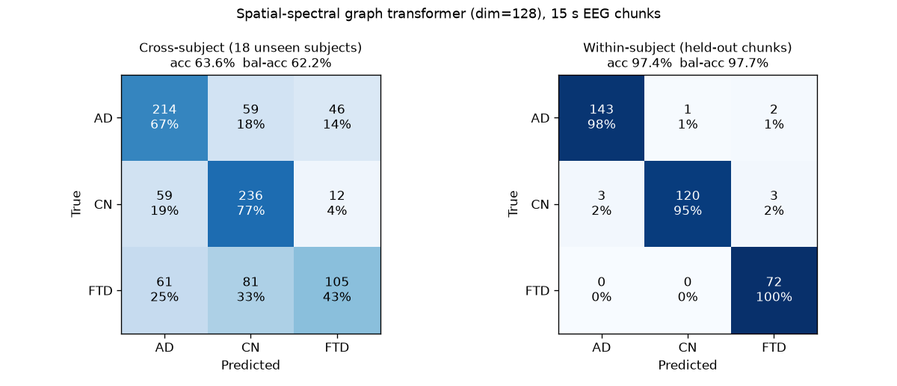
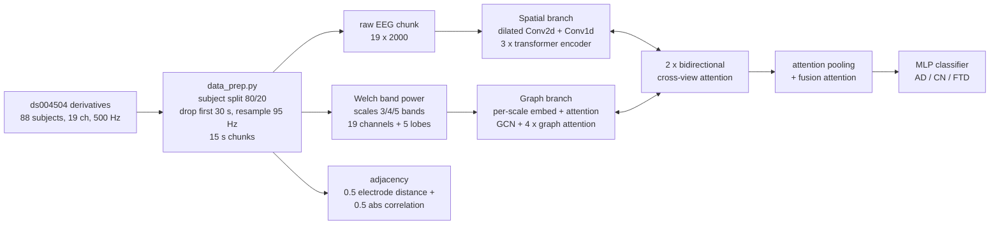

# Spatial-Spectral Graph Transformer for Dementia Classification from EEG

Three-way classification of **Alzheimer's disease (AD)**, **frontotemporal dementia (FTD)** and **cognitively normal (CN)** subjects from resting-state, eyes-closed scalp EEG (OpenNeuro [ds004504](https://openneuro.org/datasets/ds004504), 88 subjects, 19 channels). The main model is a two-branch transformer. One branch learns spatio-temporal features from the raw 19-channel signal with convolutions and self-attention. The other builds a graph over the electrodes (plus five brain-lobe nodes) from multi-scale Welch band-power features. Cross-view attention fuses the two branches. The model is trained with 5-fold cross-validation and evaluated on **18 subjects never seen in training**. The repo also contains the baselines we compared against: SVM, EEGNet, a multi-view transformer, CWT and time-graph variants.

This started as a team project for the NYU *Neuroinformatics* course (Spring 2025).

## Key results

The unit of evaluation is a 15-second EEG chunk (95 Hz, 1424 samples). The data are split by **subject** (80/20, seed 42):

| Model (checkpoint) | Params | Cross-subject acc. | Cross-subject bal. acc. | Cross-subject weighted F1 | Within-subject acc. |
|---|---:|---:|---:|---:|---:|
| **Spatial-spectral graph transformer, `dim=128`** | 1.67 M | **63.6 %** | **62.2 %** | **62.7 %** | 97.4 % |
| Spatial-spectral graph transformer, `dim=264` | 7.14 M | 60.1 % | 58.5 % | 59.1 % | 98.6 % |
| Multi-view transformer (MVT) baseline¹ | – | 64.5 % | – | – | 89.8 % |
| RBF-SVM on hand-crafted features¹ | – | 48.6 % | – | – | 71.2 % |
| Chance (majority class) | – | 36.5 % | 33.3 % | – | 42.4 % |

- **Cross-subject** (`test_cross`) uses 873 chunks from 18 held-out subjects (7 AD, 6 CN, 5 FTD). This is the number that matters clinically.
- **Within-subject** (`test_within`) uses 344 held-out chunks from the 70 *training* subjects. The model has already seen other minutes of these same recordings, so this score is optimistic. It measures memorisation of subject identity as much as disease.
- Per-class cross-subject ROC-AUC (one-vs-rest, `dim=128`): AD 0.79, CN 0.84, FTD 0.65. FTD is the hardest class and is most often confused with CN.
- Within the three-class task, pairwise accuracy (predictions restricted to two classes) is AD/CN 71.9 %, AD/FTD 56.4 % and CN/FTD 61.6 %.
- The two graph-transformer rows were **re-evaluated on CPU for this release** (`results/*/reeval_matched_features/`). They agree with the numbers logged on GPU in April 2025 to within 0.5 pp (63.46 % logged vs 63.57 % re-run for `dim=128`); the small gap comes from GPU mixed precision.
- 5-fold CV validation accuracy during training was about 99 %. Those folds split *chunks*, not subjects, so the number is not a generalisation estimate. The cross-subject test set is.

¹ These baseline numbers are taken from the team's saved artifacts and were not re-run for this release: the SVM from [`results/baselines/svm/`](results/baselines/svm/), the MVT from its confusion matrices in [`results/baselines/figures/`](results/baselines/figures/). The EEGNet figures in that folder could not be traced to the current split, so they are not reported here.



**Takeaway.** EEG chunks from *known* subjects are almost perfectly separable (97-99 %). Generalising to *new* subjects is much harder: about 62-64 %, with FTD the weak spot. The larger `dim=264` model fits the training subjects better and generalises worse. It is also worth noting that the simpler MVT baseline reaches similar cross-subject accuracy. The obvious next steps are subject-level evaluation (majority vote over a subject's chunks), leave-subject-out CV folds so that model selection stops rewarding memorisation, and subject-wise normalisation.

## Method



- **Preprocessing** ([`data_prep.py`](data_prep.py)) starts from the dataset's preprocessed `derivatives/` recordings (already band-pass filtered and ICA/ASR-cleaned by the dataset authors). Participants are split 80/20 by subject. For each recording the first 30 s are dropped and the signal is resampled to 95 Hz. It is then cut into 1424-sample (~15 s) chunks, and a random 10 % of training-subject chunks form the within-subject test set.
- **Features** ([`eeg_dataset_multispatialgraph_spectral_advanced.py`](eeg_dataset_multispatialgraph_spectral_advanced.py)):
  - Raw signals are z-scored per channel.
  - Log Welch band power is computed at three spectral "scales": 3 bands (0.5-8, 8-13, 13-30 Hz), 4 bands (delta, theta, alpha, beta) and 5 bands (adding gamma). Each is computed per electrode and averaged per lobe (frontal, central, temporal, parietal, occipital).
  - The dynamic adjacency mixes 10-20 electrode distance with absolute signal correlation.
- **Model** ([`eeg_multi_spatial_graph_spectral_advanced.py`](eeg_multi_spatial_graph_spectral_advanced.py)): `MVTSpatialSpectralModel`, shown in the diagram above.
- **Training** ([`train_kfold_multi_spatial_graph_spectral_advanced.py`](train_kfold_multi_spatial_graph_spectral_advanced.py)):
  - Classes are balanced by undersampling (729 chunks each), then trained with stratified 5-fold CV.
  - The optimiser is AdamW (lr 3e-4, wd 1e-3) with a 5-epoch warm-up and ReduceLROnPlateau.
  - The loss is label-smoothed cross-entropy plus auxiliary spatial/graph heads (0.3) and a cosine alignment loss between the branches (0.1).
  - Training uses mixed precision on GPU, gradient clipping at 0.3, and early stopping with patience 30.
  - The checkpoint with the best validation accuracy across folds is kept as `best_model_overall.pth`.
- **Evaluation** ([`test_multispatial_graph_spectral_advanced.py`](test_multispatial_graph_spectral_advanced.py)) reports accuracy, balanced accuracy, weighted P/R/F1, per-class specificity, ROC-AUC and PR-AUC, the confusion matrix and inference time.

## Dataset

The data are **not included** in this repository. Download OpenNeuro **ds004504**, *"A dataset of EEG recordings from: Alzheimer's disease, Frontotemporal dementia and Healthy subjects"*. It has 36 AD, 23 FTD and 29 CN subjects, recorded eyes-closed at rest with 19 channels (10-20 system).

```bash
# Option A: OpenNeuro CLI / DataLad
datalad install https://github.com/OpenNeuroDatasets/ds004504.git
cd ds004504 && datalad get participants.tsv derivatives

# Option B: AWS S3 (no account needed)
aws s3 sync --no-sign-request s3://openneuro.org/ds004504 ds004504
```

Only `participants.tsv` and `derivatives/sub-*/eeg/*.set` are used. Then build the chunked dataset (about 540 MB):

```bash
python data_prep.py --bids-root path/to/ds004504 --output-dir model-data
```

This writes `model-data/{train,test}/*.set`, `model-data/labels.json` and `model-data/participants.tsv`. Every script also reads the environment variable `EEG_DATA_DIR` if you keep the data elsewhere. With the same `participants.tsv`, the seed-42 subject split is deterministic and reproduces the held-out subjects used above (sub-002, 003, 015, 021, 022, 024, 030, 038, 052, 053, 060, 061, 064, 072, 075, 076, 082, 083).

## Setup

Python 3.10-3.12. The commands use [uv](https://docs.astral.sh/uv/); plain `python -m venv` + `pip` works too.

**Windows (PowerShell)**

```powershell
uv venv --python 3.12
.venv\Scripts\activate
# GPU (optional): install a CUDA build of PyTorch first
uv pip install torch --index-url https://download.pytorch.org/whl/cu124
uv pip install -r requirements.txt
python -c "import torch; print(torch.__version__, torch.cuda.is_available())"
```

**macOS / Linux**

```bash
uv venv --python 3.12
source .venv/bin/activate
uv pip install -r requirements.txt     # macOS uses the CPU/MPS build of PyTorch
```

## Usage

Run everything from the repository root.

```bash
# 1. Prepare data (once)
python data_prep.py --bids-root path/to/ds004504 --output-dir model-data

# 2. Train: 5-fold CV, up to 200 epochs/fold with early stopping (the logged dim=128 run took ~8 h on an RTX 3080 Ti Laptop)
python train_kfold_multi_spatial_graph_spectral_advanced.py --data-dir model-data --dim 128
#    optional: --wandb (log to Weights & Biases), --folds 1, --epochs 50, --batch-size 16, --device cpu

# 3. Evaluate the best checkpoint on the cross- and within-subject test sets
python test_multispatial_graph_spectral_advanced.py \
    --model-path spatial_spectral_<timestamp>/models/best_model_overall.pth --dim 128
```

Each training run writes `spatial_spectral_<timestamp>/{models,checkpoints,logs}`. Evaluation writes `spatial_results_<timestamp>/` containing per-split `.txt` and `.json` reports and a `comparison_summary.txt`.

**Quick smoke test on CPU (about 1 minute):**

```bash
python train_kfold_multi_spatial_graph_spectral_advanced.py --device cpu --epochs 1 --folds 1 \
    --max-samples-per-class 16 --batch-size 4 --num-workers 0
python test_multispatial_graph_spectral_advanced.py --device cpu --num-workers 0 --max-samples 30 \
    --model-path spatial_spectral_<timestamp>/models/best_model_overall.pth
```

The trained weights for the best model (`dim=128`, 6.9 MB) are attached to the [v1.0 release](https://github.com/happyc0der/eeg-dementia-graph-transformer/releases/tag/v1.0) as `eeg-graph-transformer-dim128.pth` (SHA-256 `28eded145850e31fd688c1f689bf3b34aba7f6091f0d53c68b764adf99235051`). Download it and, once the data is prepared (see above), evaluate without training:

```bash
gh release download v1.0 -R happyc0der/eeg-dementia-graph-transformer -p eeg-graph-transformer-dim128.pth
python test_multispatial_graph_spectral_advanced.py --model-path eeg-graph-transformer-dim128.pth --dim 128
```

(or download it from the release page in a browser). The same release also has the `dim=264` model
(`eeg-graph-transformer-dim264.pth`, use `--dim 264`) and the SVM baseline's models and results
(`svm-baseline-models.zip`). Weights are not tracked in git.

### Baselines

The [`baselines/`](baselines/) folder holds the earlier models, kept as-is from the course project. Run them from the repo root (for example `python baselines/train_kfold_svm.py`); they expect `model-data/` in the working directory.

| Scripts | Model |
|---|---|
| `train_kfold_svm.py`, `train_kfold_svm_grid.py`, `test_svm.py` | RBF-SVM on per-channel statistical and spectral features |
| `train_kfold.py`, `train_batch.py`, `test.py`, `hyperparameter_tuning.py` | EEGNet-style CNN (Optuna tuning) |
| `train_kfold_mvt.py`, `test_mvt.py` (+ `_mfeat` variants) | Multi-view transformer: time, frequency and spatial views with cross-view attention ([diagram](docs/mvt_architecture.svg)) |
| `train_kfold_multiscale_spectral.py`, `test_multiscale_spectral.py` | Multi-scale spectral graph transformer |
| `train_kfold_multi_time_graph_spectral.py`, `test_multitime_graph_spectral.py` | Multi-scale time-window graph variant |
| `train_kfold_multi_spatial_graph_spectral.py`, `test_multispatial_graph_spectral.py` | First version of the spatial-spectral model |
| `train_kfold_cwt_eeg.py` | Continuous-wavelet (CWT) time-frequency transformer/CNN |
| `train_batch_new_mvt.py`, `eeg_eegpt_mvt.py` | EEGPT-based experiment. Needs the external EEGPT code and pretrained weights (not included), so it is not runnable standalone |

## Project structure

```
.
├── data_prep.py                                         # ds004504 -> 15 s chunks + labels.json
├── eeg_dataset_multispatialgraph_spectral_advanced.py   # Dataset: raw EEG, band-power graph features, adjacency
├── eeg_multi_spatial_graph_spectral_advanced.py         # MVTSpatialSpectralModel
├── train_kfold_multi_spatial_graph_spectral_advanced.py # training (k-fold CV)
├── test_multispatial_graph_spectral_advanced.py         # evaluation on held-out subjects/chunks
├── requirements.txt
├── baselines/        # SVM, EEGNet, MVT, CWT, multiscale/time-graph and earlier variants
├── tools/            # cuda_test.py, data_vis.py (MNE signal browser)
├── docs/             # MVT architecture diagram
└── results/
    ├── spatial_spectral_dim128_20250405/   # best model: training log, logged + re-evaluated metrics, confusion matrices
    ├── spatial_spectral_dim264_20250407/   # larger model: training log (2 folds), metrics
    └── baselines/                          # SVM results JSON, MVT/SVM/EEGNet figures, MVT loss curves
```

## Credits

- **Team (NYU Neuroinformatics, Spring 2025):** [Subhrajit Dey (@subro608)](https://github.com/subro608), who wrote most of the model and training code, [Keshav Rajput (@happyc0der)](https://github.com/happyc0der), [Sirish Visweswar (@itsSirish)](https://github.com/itsSirish) and [@terka2610](https://github.com/terka2610). The original shared repository is [subro608/Neuroinformatics](https://github.com/subro608/Neuroinformatics). This repo is a cleaned-up snapshot with a fresh history.
- The EEGNet baseline and the original data-prep script build on [Leofierus/eeg-alzheimers-detection](https://github.com/Leofierus/eeg-alzheimers-detection).
- **Dataset:** Miltiadous, A., Tzimourta, K. D., Afrantou, T., et al. (2023). *A Dataset of Scalp EEG Recordings of Alzheimer's Disease, Frontotemporal Dementia and Healthy Subjects from Routine EEG.* Data, 8(6), 95. https://doi.org/10.3390/data8060095. Available on OpenNeuro as [ds004504](https://openneuro.org/datasets/ds004504).

## License

No license file is included yet: the code was written jointly by the team, so any license should be agreed with the co-authors (MIT is suggested). The EEG data are **not** redistributed here and remain under the dataset's own OpenNeuro terms (CC0).
