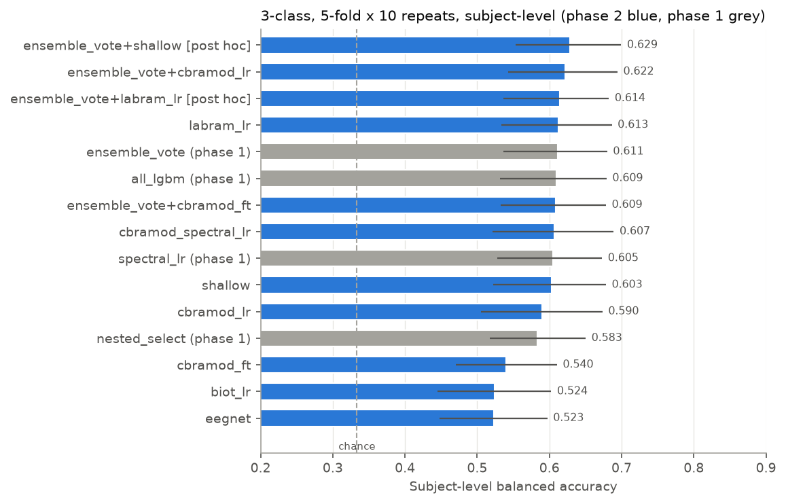

# EEG dementia classification: an honest, subject-level re-evaluation

Three-way classification of **Alzheimer's disease (AD)**, **frontotemporal dementia (FTD)** and **cognitively normal controls (CN)** from resting-state, eyes-closed scalp EEG (OpenNeuro [ds004504](https://openneuro.org/datasets/ds004504): 88 subjects, 19 channels). The project started as a Spring-2025 course project whose graph transformer reported 63.6 % accuracy on one 18-subject test split, after model selection on chunk-level folds that leaked subjects (99 % validation accuracy). This repository re-evaluates the task with **every split made over subjects, nested model selection, 10 × repeated 5-fold cross-validation, subject-level metrics with bootstrap confidence intervals and permutation tests**, and compares 16 feature-based pipelines with EEG foundation models (LaBraM, CBraMod, BIOT) and CNNs (ShallowFBCSPNet, EEGNet) under one protocol, pre-registered for the deep models.

**Bottom line.** Honest 3-class performance is about **60 % subject-level balanced accuracy** (chance 33 %), with a 95 % CI of roughly ±7 pp. The best pre-specified model, a soft vote of three feature models, reaches **61.1 ± 3.0 % [53.6, 68.0]** (macro AUC 0.786). **No deep model beats it**: frozen LaBraM embeddings + logistic regression reach 61.3 %, ShallowFBCSPNet 60.3 %, and three deep models are significantly worse. CN vs dementia works (AD vs CN: 84.6 % leave-one-subject-out accuracy, in line with rigorous studies in the literature), but **AD vs FTD stays near 60 %** with every representation tried. With 88 subjects, differences under about 5 pp between models cannot be demonstrated.

- Phase 1 (feature models, the evaluation harness, data findings): [`results/phase1_summary.md`](results/phase1_summary.md)
- Phase 2 (deep models): [`results/phase2_plan.md`](results/phase2_plan.md), committed before any outer-fold run, and [`results/phase2_summary.md`](results/phase2_summary.md)
- The original 2025 code, its credits and its known problems: [`legacy/`](legacy/)

Every results table below is generated from the files in [`results/`](results/) by [`scripts/make_readme_tables.py`](scripts/make_readme_tables.py), and `tests/test_readme.py` fails if the README and the result files disagree.

## Contents

1. [Key results](#key-results)
2. [What changed from the original project](#what-changed-from-the-original-project)
3. [What drives the classifier](#what-drives-the-classifier)
4. [Method](#method)
5. [Reproducing the results](#reproducing-the-results)
6. [Repository layout](#repository-layout)
7. [Limitations](#limitations)
8. [Credits and citations](#credits-and-citations)
9. [License](#license)

## Key results

### 3-class AD / CN / FTD (all 88 subjects, 5-fold × 10 repeats, nested)

Subject-level balanced accuracy is the mean over the 10 repeats ± the SD across repeats; the 95 % CI is a class-stratified bootstrap over subjects (2,000 resamples). "Δ vs soft vote" is a paired subject bootstrap on identical folds, computed for the phase-2 models; the pre-registered rule calls a model better or worse only if that CI excludes 0.

<!-- BEGIN GENERATED: main-3class -->
| Model | What | Phase | Subject bal. acc. %, mean ± SD [95 % CI] | Macro AUC | Recall AD / CN / FTD % | Δ vs soft vote, pp [paired 95 % CI] |
|---|---|---:|---:|---:|---:|---:|
| **Soft vote** (phase 1) | spectral LR + Riemannian LR + LightGBM, pre-specified | 1 | 61.1 ± 3.0 [53.6, 68.0] | 0.786 | 69 / 86 / 28 | reference |
| LightGBM, all features | 1,213 features | 1 | 60.9 ± 2.3 [53.2, 67.9] | 0.776 | 72 / 86 / 26 | – |
| **Spectral LR** | logistic regression, 399 spectral/aperiodic features | 1 | 60.5 ± 3.3 [52.8, 67.3] | 0.757 | 64 / 81 / 37 | – |
| LR, all features | 1,213 features | 1 | 60.4 ± 3.3 [53.3, 67.2] | 0.755 | 62 / 84 / 34 | – |
| LR, relative band power | the dataset authors' feature (95) | 1 | 58.5 ± 2.4 [51.0, 65.8] | 0.756 | 64 / 79 / 32 | – |
| Nested model selection | inner CV picks family + hyper-parameters | 1 | 58.3 ± 3.6 [51.7, 65.0] | 0.742 | 64 / 80 / 31 | – |
| **LaBraM frozen** + LR | foundation model, 3,800-d embedding | 2 | 61.3 ± 2.5 [53.3, 68.7] | 0.757 | 66 / 85 / 33 | +0.2 [-4.9, +5.2] |
| **ShallowFBCSPNet** | CNN trained from scratch | 2 | 60.3 ± 3.2 [52.2, 67.8] | 0.774 | 62 / 79 / 40 | -0.8 [-6.1, +4.8] |
| CBraMod frozen + spectral + LR | hybrid features | 2 | 60.7 ± 2.7 [52.1, 68.9] | 0.750 | 66 / 74 / 43 | -0.5 [-6.3, +5.6] |
| CBraMod frozen + LR | pre-registered primary foundation model | 2 | 59.0 ± 3.1 [50.5, 67.4] | 0.738 | 65 / 73 / 40 | -2.1 [-7.8, +4.0] |
| CBraMod fine-tuned | foundation model, end to end | 2 | 54.0 ± 2.9 [47.0, 61.1] | 0.686 | 53 / 85 / 24 | -7.1 [-13.3, -0.5] |
| EEGNet | CNN trained from scratch | 2 | 52.3 ± 2.6 [44.8, 59.7] | 0.728 | 42 / 58 / 56 | -8.8 [-16.1, -1.6] |
| BIOT frozen + LR | exploratory | 2 | 52.4 ± 4.7 [44.5, 60.3] | 0.676 | 61 / 72 / 24 | -8.7 [-15.8, -1.6] |
| Soft vote + CBraMod LR | pre-registered primary hybrid | 2 | 62.2 ± 3.0 [54.3, 69.4] | 0.783 | 69 / 86 / 32 | +1.1 [-1.1, +3.5] |
| Soft vote + ShallowFBCSPNet | **post hoc** (member chosen after seeing cv3) | 2 | 62.9 ± 3.3 [55.3, 69.9] | 0.792 | 70 / 87 / 32 | +1.8 [+0.1, +3.5] |
| Age + sex only | confound baseline | 1 | 42.6 ± 3.2 [33.5, 51.6] | 0.583 | 58 / 33 / 36 | – |
| Chance (class prior) | DummyClassifier | 1 | 33.3 ± 0.0 [33.3, 33.3] | 0.481 | 100 / 0 / 0 | – |
<!-- END GENERATED: main-3class -->



- **Thirteen of the 16 EEG-only feature pipelines land between 58 and 61 %** ([full table](results/tables/cv3.md)), and their CIs overlap almost completely. Letting the inner CV choose the model family as well (`nested_select`, 58.3 %) is the unbiased estimate of "pick the best feature model"; the 2-3 pp gap to the best single model is the optimism of choosing a winner after the fact.
- **Deep models do not beat features.** Frozen foundation-model embeddings with a linear head behave like spectral features (LaBraM 61.3 %, CBraMod 59.0 %). ShallowFBCSPNet, whose architecture is a learned filter bank followed by log band power, reaches 60.3 %. EEGNet (52.3 %), fine-tuned CBraMod (54.0 %) and frozen BIOT (52.4 %) are significantly *worse* than the soft vote; fine-tuning CBraMod on about 56 subjects per bag lost 5 pp against freezing it. Why: with 70 training subjects per fold the networks start memorising subjects within a few epochs (ShallowFBCSPNet's median early-stopping epoch is 2 of up to 40), and the information the classifiers use is the EEG slowing that band power already captures ([below](#what-drives-the-classifier)).
- **The only positive paired CI is post hoc.** Adding ShallowFBCSPNet to the soft vote gives 62.9 % (+1.8 pp [+0.1, +3.5], better in 7 of 10 repeats). But ShallowFBCSPNet was picked *because* it was the best end-to-end model, it is one of 11 phase-2 comparisons against the soft vote, and there is no multiplicity correction. It is a **hypothesis for an independent dataset, not a finding**. The pre-registered hybrid (soft vote + frozen CBraMod) gives +1.1 pp [−1.1, +3.5].
- **CN is easy, FTD is hard.** Across the 13 best feature pipelines CN recall is 77-90 %, but FTD recall only 26-39 %; the soft vote classifies 46 % of FTD subjects as AD.

### Binary tasks and the literature

Leave-one-subject-out (LOSO), as used by the dataset authors. Epoch-level accuracy pools every epoch of the left-out subjects, which is how the literature numbers were computed.

<!-- BEGIN GENERATED: binary-loso -->
| Task | Model | Subject acc. % [95 % CI] | Subject bal. acc. % | Subject AUC | Epoch acc. % |
|---|---|---:|---:|---:|---:|
| AD vs CN | LR, all features (ours) | 84.6 [75.4, 92.3] | 85.4 | 0.883 | 79.7 |
| AD vs CN | LR, relative band power (ours) | 80.0 [70.8, 89.2] | 80.3 | 0.871 | 77.2 |
| AD vs CN | Age only (ours) | 50.8 [38.5, 63.1] | 50.5 | 0.519 | 50.0 |
| AD vs CN | Miltiadous 2023 (Data), RF, RBP, epoch-level |  |  |  | 77.0 |
| AD vs CN | DICE-net 2023, epoch-level |  |  |  | 83.3 |
| AD vs CN | AHEPA benchmark 2026, mean of validity-1 studies |  |  |  | 82.1 |
| FTD vs CN | LR, all features (ours) | 78.8 [67.3, 88.5] | 77.9 | 0.835 | 76.4 |
| FTD vs CN | LR, relative band power (ours) | 71.2 [59.6, 82.7] | 70.1 | 0.817 | 70.6 |
| FTD vs CN | Age only (ours) | 59.6 [46.2, 73.1] | 59.3 | 0.585 | 61.1 |
| FTD vs CN | Miltiadous 2023 (Data), MLP, RBP, epoch-level |  |  |  | 73.1 |
| FTD vs CN | AHEPA benchmark 2026, mean of validity-1 studies |  |  |  | 75.2 |
<!-- END GENERATED: binary-loso -->

- Our relative-band-power LR reproduces the dataset authors' RBP benchmark almost exactly (77.2 % vs 77.0 % epoch-level, AD vs CN), and our best LOSO results (84.6 % and 78.8 % subject-level) sit where the benchmark review's subject-validated ("validity-1") studies land. There is no sign of leakage, and no sign of a breakthrough.
- Literature sources, checked against the papers: the dataset paper (Miltiadous et al. 2023, *Data*, Tables 2-3: best of RF / LightGBM / SVM / MLP / kNN on relative band power), DICE-net (Miltiadous et al. 2023, *IEEE Access*, abstract; AD vs CN only) and the AHEPA benchmark review (Miltiadous et al. 2026, *Cognitive Neurodynamics*, Table 15). Full references are [below](#credits-and-citations); details in [`results/phase1_summary.md`](results/phase1_summary.md), section 6.4.

Repeated nested CV (5-fold × 10) for the three binary tasks, including the hard one, AD vs FTD:

<!-- BEGIN GENERATED: binary-cv -->
| Task | Model | Subject bal. acc. %, mean ± SD [95 % CI] | Subject AUC |
|---|---|---:|---:|
| AD vs CN | spectral_lr | 82.3 ± 4.1 [74.9, 89.0] | 0.884 |
| AD vs CN | rbp_lr | 79.0 ± 2.4 [70.4, 87.1] | 0.851 |
| AD vs CN | age_lr | 50.0 ± 1.2 [37.6, 62.3] | 0.531 |
| FTD vs CN | spectral_lr | 75.2 ± 3.5 [65.7, 84.3] | 0.792 |
| FTD vs CN | rbp_lr | 73.9 ± 3.7 [63.9, 83.1] | 0.808 |
| FTD vs CN | age_lr | 58.3 ± 0.9 [44.6, 70.8] | 0.630 |
| AD vs FTD | rbp_lr | 62.5 ± 3.3 [52.0, 72.6] | 0.645 |
| AD vs FTD | spectral_lr | 60.0 ± 4.4 [50.0, 70.2] | 0.599 |
| AD vs FTD | shallow (post hoc) | 62.2 ± 4.7 [51.6, 72.1] | 0.616 |
| AD vs FTD | cbramod_lr | 59.6 ± 4.1 [49.6, 70.4] | 0.597 |
| AD vs FTD | labram_lr | 55.3 ± 3.9 [44.3, 66.1] | 0.595 |
| AD vs FTD | age_lr | 54.3 ± 0.9 [40.1, 67.2] | 0.553 |
<!-- END GENERATED: binary-cv -->

No representation, hand-crafted or learned, separates AD from FTD better than relative band power (62.5 %, AUC 0.645). FTD sits between CN and AD on nearly every spectral axis, so the two dementias differ mainly in the *degree* of slowing.

### Everything is far above chance

Subject-label permutation tests of the **whole nested pipeline**: labels are shuffled across subjects and the inner model selection is rerun every time. The observed value is the 10-repeat mean, while each permutation runs one 5-fold CV, whose null is wider than that of a 10-repeat mean, so the p-values are conservative. In all three tests no permutation reached the observed value, so p is the smallest value the number of permutations allows.

<!-- BEGIN GENERATED: permutation -->
| Pipeline | Observed % | Null mean ± SD % | Null 95th pct. % | Permutations | p | Smallest possible p |
|---|---:|---:|---:|---:|---:|---:|
| [rbp_lr](results/permutation/rbp_lr.json) | 58.5 | 33.5 ± 6.1 | 42.7 | 500 | 0.002 | 1/501 = 0.002 |
| [spectral_lr](results/permutation/spectral_lr.json) | 60.5 | 33.5 ± 6.4 | 44.1 | 100 | 0.010 | 1/101 = 0.010 |
| [cbramod_lr](results/phase2/permutation/cbramod_lr.json) | 59.0 | 33.4 ± 7.3 | 46.7 | 50 | 0.020 | 1/51 = 0.020 |
<!-- END GENERATED: permutation -->

## What changed from the original project

| | Original project (2025, [`legacy/`](legacy/)) | This re-evaluation |
|---|---|---|
| Model selection | 5-fold CV over **chunks**: chunks of one recording in both training and validation folds (~99 % validation accuracy) | every split over **subjects**; hyper-parameters chosen by an inner CV on the training subjects only |
| Test estimate | one 80/20 split, **18 test subjects** | 5-fold × 10 repeats over all 88 subjects, plus LOSO |
| Unit of evaluation | 15 s chunk | subject (primary; mean epoch log-probability) and 10 s epoch |
| Uncertainty | none | bootstrap CIs over subjects, paired bootstrap for model differences, permutation tests |
| Reference | native A1-A2 derivatives, channels z-scored | average reference (see below) |
| End crop | `raw.crop(tmax=raw.times[-30])`: 30 **samples** instead of 30 s | 30 s at both ends |
| Artefacts | not handled | windows touching ASR `boundary` discontinuities dropped; per-subject robust amplitude rejection |

**Native-reference artefact.** In the derivative recordings as distributed (A1-A2 reference), about **92 % of every channel's variance is one common-mode signal**, mostly below 2 Hz, of about 32 µV SD in *every* subject and with no group difference. The old pipeline z-scored these channels, so most of its raw input was this artefact. The average reference removes it, and all three models tested with both references classify better with the average reference (by 2-5 pp; see the sensitivity table below). Details: [`results/phase1_summary.md`](results/phase1_summary.md), section 2.

**Why one 18-subject split cannot rank models.** On the old split a logistic regression on spectral features already beats the old transformer at epoch level. But the subject-level 95 % CI spans about ±20 pp, the split is easier than average (`spectral_lr`: 66.8 % subject-level balanced accuracy here vs 60.5 % in repeated CV), and the ranking on it disagrees with the 10-repeat CV (LaBraM 71.6 % here vs 61.3 %; CBraMod 53.8 % vs 59.0 %). The chance-level spread of a single 5-fold CV on 88 subjects is already about ±6 pp (1 SD of the permutation nulls).

<!-- BEGIN GENERATED: legacy-split -->
| Model | Epoch acc. % | Epoch bal. acc. % | Subject bal. acc. % [95 % CI] |
|---|---:|---:|---:|
| Graph transformer, dim=128 (April 2025) | 63.6 (chunks) | 62.2 (chunks) | – |
| all_lgbm | 68.8 | 67.7 | 69.7 [48.2, 87.8] |
| spectral_lr | 67.4 | 67.0 | 66.8 [45.1, 85.7] |
| ensemble_vote | 66.7 | 65.7 | 59.4 [36.5, 81.9] |
| nested_select | 62.4 | 62.0 | 72.7 [50.2, 90.5] |
| labram_lr | 68.3 | 67.2 | 71.6 [49.5, 90.5] |
| shallow | 66.8 | 65.8 | 65.7 [47.6, 83.8] |
| cbramod_lr | 56.6 | 55.4 | 53.8 [31.2, 76.3] |
| chance_prior | 36.4 | 33.3 | 33.3 [33.3, 33.3] |
<!-- END GENERATED: legacy-split -->

The old model's numbers are chunk-level, from [`legacy/results/`](legacy/results/); ours are 10 s epochs and subjects. Full tables for this split: [`results/tables/legacy.md`](results/tables/legacy.md) and [`results/phase2/tables/legacy.md`](results/phase2/tables/legacy.md).

### Sensitivity analyses

Pre-specified models under alternative preprocessing, same repeated nested CV (subject-level balanced accuracy, mean ± SD [95 % CI]). "Training rows" is the number of epochs (or subjects) the models were trained and evaluated on; the native-reference cache keeps 11,796 epochs instead of 11,616 because amplitude rejection runs on the re-referenced signal.

<!-- BEGIN GENERATED: sensitivity -->
| Condition | Training rows | rbp_lr | spectral_lr | all_lr |
|---|---:|---:|---:|---:|
| average reference, 10 s / 5 s epochs (main) | 11,616 | 58.5 ± 2.4 [51.0, 65.8] | 60.5 ± 3.3 [52.8, 67.3] | 60.4 ± 3.3 [53.3, 67.2] |
| native A1-A2 reference, 10 s / 5 s | 11,796 | 53.6 ± 3.4 [45.3, 61.7] | 58.6 ± 2.7 [50.8, 66.7] | 58.4 ± 1.9 [51.3, 65.7] |
| average reference, 4 s / 2 s | 30,407 | 58.2 ± 2.9 [50.4, 66.0] | 62.9 ± 4.3 [55.3, 69.9] | – |
| average reference, 30 s / 15 s, boundary windows kept | 4,094 | 56.5 ± 3.9 [49.4, 63.4] | 58.3 ± 2.5 [50.4, 65.7] | – |
| one row per subject (features averaged over epochs) | 88 | 57.4 ± 4.1 [49.9, 64.5] | 58.4 ± 2.2 [50.5, 66.0] | 57.5 ± 3.3 [49.6, 65.3] |
<!-- END GENERATED: sensitivity -->

The average reference wins for all three models. Window length changes little: 4 s windows raise `spectral_lr` by 2.4 pp but leave `rbp_lr` unchanged, and 30 s windows are slightly lower; the main analysis was not switched to 4 s after seeing this. Training on subject means is slightly worse than training on epochs and aggregating, so the epochs act as useful augmentation.

## What drives the classifier

The classic **EEG slowing** of dementia: less alpha and beta, more theta, a lower peak (alpha) frequency and a higher theta/alpha ratio. The effects are large for AD vs CN, medium for FTD vs CN and small for AD vs FTD, and FTD lies between CN and AD on nearly every axis. 280 of 648 spectral, aperiodic and complexity features differ between the groups at FDR q < 0.05 (Kruskal-Wallis on subject means, [`results/interpretability/`](results/interpretability/)). Regional means (g = Hedges' g):

<!-- BEGIN GENERATED: slowing -->
| Feature (subject means) | AD | FTD | CN | g AD-CN | g FTD-CN | g AD-FTD | FDR q |
|---|---:|---:|---:|---:|---:|---:|---:|
| Peak frequency (5-14 Hz), frontal | 7.34 | 8.66 | 9.54 | -1.54 | -0.80 | -0.80 | 6e-05 |
| Peak frequency (5-14 Hz), temporal | 7.56 | 8.97 | 9.75 | -1.56 | -0.63 | -0.86 | 5e-05 |
| Peak frequency (5-14 Hz), parietal | 7.69 | 9.06 | 9.88 | -1.37 | -0.68 | -0.75 | 0.0004 |
| Peak frequency (5-14 Hz), occipital | 7.72 | 9.12 | 9.71 | -1.30 | -0.50 | -0.81 | 0.0003 |
| log10 theta/alpha power, frontal | 0.09 | -0.12 | -0.58 | +1.67 | +1.42 | +0.48 | 5e-06 |
| log10 theta/alpha power, temporal | 0.05 | -0.22 | -0.64 | +1.82 | +1.25 | +0.58 | 7e-06 |
| log10 theta/alpha power, parietal | -0.00 | -0.24 | -0.70 | +1.53 | +1.30 | +0.45 | 8e-06 |
| log10 theta/alpha power, occipital | -0.05 | -0.35 | -0.83 | +1.73 | +1.20 | +0.57 | 5e-06 |
<!-- END GENERATED: slowing -->


On held-out subjects (grouped permutation importance of `spectral_lr`, 3 × 5 folds), shuffling the **temporal** channels costs the AD-vs-rest AUC 0.25, and **frontal** channels matter most for FTD-vs-rest (0.09). That fits temporoparietal slowing in AD and frontal / anterior-temporal involvement in FTD. The fold-to-fold SDs are large, so treat the ranking as indicative ([CSV](results/interpretability/permutation_importance_spectral_lr.csv), [figure](results/interpretability/permutation_importance_spectral_lr.png)).

Age and sex explain little: age alone gives 36.9 % 3-class balanced accuracy, age + sex 42.6 %, and adding them to the EEG models changes nothing measurable ([`results/tables/cv3.md`](results/tables/cv3.md)). Age is a mild confound for FTD vs CN only: FTD patients are about 4 years younger, and age alone reaches 58-60 %.

## Method

### Data

OpenNeuro **ds004504** v1.0.9 (Miltiadous et al., 2023; CC0): 36 AD, 29 CN and 23 FTD subjects, resting state with eyes closed, 19 channels (10-20 system), 500 Hz, 5-21 min per recording. Only `participants.tsv` and the dataset authors' preprocessed `derivatives/` are used (0.5-45 Hz band-pass, A1-A2 re-reference, ASR and ICA cleaning). MMSE is never used, because it is essentially the label.

### Preprocessing and epochs ([`eegdementia/data.py`](eegdementia/data.py))

Crop 30 s at both ends, re-reference to the average, resample to 250 Hz, cut 10 s windows with a 5 s step, drop windows within 0.5 s of an ASR `boundary` event, and drop windows whose log peak-to-peak amplitude exceeds the subject's own median + 5 robust SDs. Every step works on one subject at a time and uses no label, so it is done once, up front. Epoch yield ([`results/tables/epochs__average_10s_5s.csv`](results/tables/epochs__average_10s_5s.csv)):

<!-- BEGIN GENERATED: epochs -->
| Group | Subjects | 10 s windows | Dropped: ASR boundary | Dropped: amplitude | Epochs kept | Per subject | Hours (after crop) |
|---|---:|---:|---:|---:|---:|---:|---:|
| AD | 36 | 5,339 | 328 | 159 | 4,852 | 47-225 | 7.5 |
| CN | 29 | 4,431 | 297 | 122 | 4,012 | 96-167 | 6.2 |
| FTD | 23 | 3,005 | 167 | 86 | 2,752 | 40-165 | 4.2 |
| **total** | 88 | 12,775 | 792 | 367 | **11,616** | 40-225 | 17.9 |
<!-- END GENERATED: epochs -->

### Features ([`eegdementia/features.py`](eegdementia/features.py))

1,348 features per epoch, each computed from that epoch alone:

- **spectral:** Welch absolute and relative band power in the dataset authors' bands (delta 0.5-4, theta 4-8, alpha 8-13, beta 13-25, gamma 25-45 Hz), theta/alpha and slow/fast ratios, peak frequency and alpha centre of gravity, spectral entropy, median and 95 % edge frequency;
- **aperiodic:** specparam exponent, offset and fit quality;
- **complexity:** Hjorth parameters, permutation and sample entropy, Higuchi fractal dimension;
- **connectivity:** per-band coherence, imaginary coherency, wPLI and amplitude-envelope correlation, summarised per channel, per region pair and globally;
- regional means of every per-channel feature, and OAS-shrunk covariance matrices for the 5 bands plus broadband (for the Riemannian models).

### Models ([`models.py`](eegdementia/models.py), [`experiments.py`](eegdementia/experiments.py), [`deep.py`](eegdementia/deep.py), [`phase2.py`](eegdementia/phase2.py))

- **Phase 1:** L2 and elastic-net logistic regression, linear and RBF SVMs, random forest and LightGBM on feature subsets; tangent-space LR and minimum distance to Riemannian means on the band covariances; a soft vote with members fixed in advance (spectral LR + tangent-space LR + LightGBM); nested model selection; age/sex confound baselines.
- **Phase 2 (pre-registered):** frozen **CBraMod** and **LaBraM** encoders with the official weights (per-channel mean of the final-layer tokens over ten 1-s patches, 19 × 200 features) and the same inner-CV logistic-regression head; a CBraMod + spectral-feature hybrid; **EEGNet** and **ShallowFBCSPNet** trained from scratch; **CBraMod fine-tuned** end to end; the soft vote with a deep 4th member; and frozen **BIOT** on a 16-channel bipolar montage as an exploratory extra. The networks are trained with "subject bagging": five networks, each early-stopped on a different fifth of the *training* subjects, are averaged. All settings are library or paper defaults and were fixed in [`results/phase2_plan.md`](results/phase2_plan.md) before any outer-fold run.

### Evaluation protocol ([`eegdementia/evaluation.py`](eegdementia/evaluation.py))

1. **Outer loop:** stratified 5-fold CV over the 88 *subjects*, repeated 10 times with different seeds. Every subject is tested once per repeat, and all of its epochs follow it. LOSO (binary and 3-class) and the legacy 18-subject split are run too, for comparison only.
2. **Inner loop:** every hyper-parameter, and for `nested_select` also the model family, is chosen by a stratified 5-fold CV over the outer-training subjects, scored by subject-level balanced accuracy; the winner is refitted on all outer-training subjects. Imputers, scalers, Riemannian reference points, classifiers and early-stopping splits are all fitted inside the training fold.
3. **Weights:** training epochs are weighted so every subject and every class carries the same total weight (40-225 epochs per subject; classes 36 / 29 / 23).
4. **Aggregation:** a subject's probability is the softmax of the mean of its epochs' log-probabilities.
5. **Metrics:** subject-level balanced accuracy (primary), accuracy, macro-F1, macro one-vs-rest AUC, per-class recall, specificity and AUC; epoch-level metrics are secondary. Mean ± SD over repeats, 95 % CIs from a class-stratified bootstrap over subjects, paired subject bootstraps for model differences, and subject-label permutation tests of the whole nested pipeline.
6. **Leakage tests** ([`tests/`](tests/)): spy estimators check that no fit call (inner, final, ensemble member, nested selection, deep early-stopping bag) ever sees a test subject, that inner validation uses training subjects only, that every subject is predicted exactly once per repeat, that the weights and the aggregation behave as specified, and that the legacy split is reproduced exactly.

## Reproducing the results

Developed on Windows 11 (Git Bash) with Python 3.12 and [uv](https://docs.astral.sh/uv/); nothing in the pipeline is Windows-specific.

```bash
git clone https://github.com/happyc0der/eeg-dementia-graph-transformer && cd eeg-dementia-graph-transformer
uv sync                                    # phase 1 (CPU only): features, feature models, harness, reports
uv run pytest                              # needs no data; tests that need the dataset or PyTorch are skipped without them
uv run python scripts/make_readme_tables.py --check    # README tables == results/ files

# phase 2 also needs PyTorch + braindecode; pick one torch build:
uv sync --extra deep --extra cpu           # any machine
uv sync --extra deep --extra cu128         # NVIDIA GPU (CUDA 12.8 wheels)
```

### Data

The EEG data are not included. Download ds004504 (about 2.8 GB of derivatives) from OpenNeuro, for example with the AWS CLI (no account needed):

```bash
export EEG_BIDS_ROOT=$PWD/data/ds004504     # the default location; data/ is git-ignored
uvx --from awscli aws s3 sync --no-sign-request s3://openneuro.org/ds004504/derivatives "$EEG_BIDS_ROOT/derivatives"
uvx --from awscli aws s3 cp --no-sign-request s3://openneuro.org/ds004504/participants.tsv "$EEG_BIDS_ROOT/"
```

or with DataLad: `datalad install https://github.com/OpenNeuroDatasets/ds004504.git`, then `datalad get participants.tsv derivatives`.

| Variable | Used for | Default |
|---|---|---|
| `EEG_BIDS_ROOT` | ds004504 (`participants.tsv`, `derivatives/`) | `data/ds004504` |
| `EEG_CACHE_DIR` | preprocessed signals, features, embeddings, epoch-level predictions, GPU checkpoints (about 7 GB for everything) | `<parent of EEG_BIDS_ROOT>/cache` |
| `EEG_WEIGHTS_DIR` | pretrained CBraMod / LaBraM / BIOT weights, downloaded and sha256-checked on first use | `data/weights` |
| `MODEL_STATUS_CMD` | optional: a script that reports other GPU users, for `GpuGuard` | `model-status` on `PATH`, if any |

### Commands

```bash
bash scripts/run_all_phase1.sh      # caches, every phase-1 experiment, permutation tests, figures, tables
bash scripts/run_all_phase2.sh      # phase-2 models (needs phase 1's cv3 / legacy / cv_ad_ftd runs and a GPU)
```

Both scripts pass `--skip-existing`, so they resume after an interruption and skip whatever is already in `results/`; delete a result folder to recompute it. Single experiments:

```bash
uv run python scripts/build_cache.py                                   # preprocessing + features (10 s / 5 s)
uv run python scripts/run_phase1.py --list                             # every phase-1 model
uv run python scripts/run_phase1.py --task cv3 --models spectral_lr    # one model, 5-fold x 10, nested
uv run python scripts/run_phase2.py --task cv3 --models labram_lr --n-jobs 10
uv run python scripts/run_phase2.py --task cv3 --models shallow --gpu # sequential, checkpointed per fold
uv run python scripts/permutation_test.py --model rbp_lr --n-perm 500
```

Tasks are `cv3` (3-class), `legacy` (the old 18-subject split), `loso3`, `loso_ad_cn`, `loso_ftd_cn`, `cv_ad_cn`, `cv_ftd_cn` and `cv_ad_ftd`. Seeds are fixed (outer splits 2026 + 1000 · repeat, models 2026 + 17 · repeat + fold), and re-running a CPU model reproduces the metrics in its `summary.json` exactly. GPU training is deterministic up to floating-point reduction order.

**Runtimes** on the machine used (Intel i9-12900HX, 64 GB RAM, RTX 3080 Ti Laptop GPU with 16 GB; CPU work in 12 below-normal-priority processes, partly alongside other workloads):

| Step | Time |
|---|---|
| Preprocessing + features, 10 s epochs | about 5 min (4 s epochs: about 25 min) |
| One phase-1 model, 3-class, 5-fold × 10, nested | 2-16 min for the LR models, 8 min random forest, 42-47 min for the SVMs on all features, the elastic net and LightGBM, 80 min tangent space, about 2 h each for the soft vote and nested selection |
| All of phase 1 (`run_all_phase1.sh`) | about 15-20 h CPU |
| Frozen CBraMod + LaBraM embeddings, all 11,616 epochs | under 1 min GPU |
| LR head on frozen embeddings, 50 outer folds | 35-40 min CPU |
| EEGNet / ShallowFBCSPNet / CBraMod fine-tuning, 50 outer folds | 79 / 79 / 131 min GPU |
| Permutation tests | 1.7 h (`rbp_lr`, 500), 1.8 h (`spectral_lr`, 100), 3.2 h (`cbramod_lr`, 50) |

Per-model compute times are in each `summary.json` (`runtime_s`, `wall_time_s`).

## Repository layout

```
.
├── eegdementia/            # the package
│   ├── config.py           #   paths (env vars), channels, bands, preprocessing / epoch / feature configs
│   ├── data.py             #   participants, preprocessing + cache, epoching and rejection
│   ├── features.py         #   per-epoch features + feature cache
│   ├── models.py           #   feature-model zoo (sklearn pipelines, Riemannian models)
│   ├── evaluation.py       #   subject-grouped nested CV, aggregation, metrics, bootstrap, permutation and paired tests
│   ├── experiments.py      #   tasks, phase-1 model specs, running and saving results
│   ├── deep.py             #   torch wrapper with subject bagging, pretrained encoders + provenance, embeddings
│   ├── phase2.py           #   phase-2 inputs and the pre-registered model specs
│   ├── gpu_guard.py        #   yields the GPU to the machine owner's jobs during long runs
│   ├── reporting.py        #   figures, table formatting, reference numbers
│   └── utils.py            #   be_nice(): single-threaded BLAS, low priority, GPU hidden unless requested
├── scripts/                # build_cache, run_phase1, run_phase2, permutation_test, interpret, make_figures,
│                           # phase2_report, make_readme_tables, run_all_phase1.sh, run_all_phase2.sh
├── tests/                  # leakage, features, deep wrapper, GPU guard, README-vs-results check
├── results/
│   ├── phase1_summary.md, phase2_plan.md, phase2_summary.md
│   ├── <task>/<model>/     # phase 1: summary.json, subject-level predictions, per-repeat and per-fold metrics
│   ├── tables/, figures/, interpretability/, permutation/
│   └── phase2/             # the same for phase 2, plus paired comparisons, training histories, GPU pause log
├── legacy/                 # the original Spring-2025 project, unchanged (see legacy/README.md)
└── pyproject.toml, uv.lock
```

`results/legacy/` holds the *new* models evaluated on the old 18-subject split, while `legacy/results/` holds the *old* project's own results. Epoch-level predictions stay in `$EEG_CACHE_DIR/predictions` and are not committed.

## Limitations

- **Small sample.** 88 subjects (70 per training fold) and only **23 FTD** patients. Subject-level 95 % CIs are about ±7 pp for 3-class balanced accuracy, and differences under about 5 pp cannot be demonstrated.
- **One dataset, one site.** There is no external validation: every number here is an internal cross-validation estimate on ds004504. The post-hoc soft vote + ShallowFBCSPNet gain in particular needs an independent cohort.
- **Age.** FTD patients are about 4 years younger than controls, and age alone separates FTD from CN at 58-60 %. The EEG models (75-79 %) are well above that, but no age-matched analysis was run.
- **Preprocessed input.** Everything starts from the dataset authors' derivatives (their filtering, ASR and ICA). The native-reference common-mode artefact found here suggests also checking the raw recordings.
- **EEGPT was not evaluated.** Its official weights are only on a figshare link that blocks scripted download, and the re-hosted copy's configuration does not match the official checkpoint, so its provenance could not be verified. LaBraM fine-tuning, an optional extra in the plan, was not run either.
- **Deep models were not tuned.** To avoid tuning on 88 subjects, every network used library or paper defaults fixed in advance, 10 s windows, no data augmentation and no hyper-parameter search. "Deep models do not beat features" holds for these pre-registered settings at this sample size; it does not rule out gains from tuned training, augmentation or pretraining on many more subjects.
- **Regularisation grid edge.** The C grid of the logistic-regression heads (1e-4 … 1, pre-registered for phase 2) was not extended after seeing that the high-dimensional heads (the 3,800-d embeddings, and `all_lr` with 1,213 features) often chose its smallest value, so they may be under-regularised.
- **Calibration.** Subject probabilities average the log-probabilities of about 130 correlated epochs, which makes them overconfident, badly so for the high-dimensional LR models (subject-level log-loss 1.2-1.5, worse than the 1.10 of a uniform guess). Balanced accuracy and AUC are unaffected, but the probabilities are not calibrated risks.

<!-- BEGIN GENERATED: c-grid -->
| Model | Outer folds choosing the smallest C (1e-4) | Subject-level log-loss |
|---|---:|---:|
| cbramod_lr | 30 / 50 | 1.45 |
| labram_lr | 18 / 50 | 1.46 |
| cbramod_spectral_lr | 30 / 50 | 1.39 |
| spectral_lr | 12 / 50 | 1.21 |
| all_lr | 20 / 50 | 1.41 |
| rbp_lr | 12 / 50 | 0.94 |
| shallow | – | 0.98 |
| ensemble_vote | – | 0.96 |
| chance (uniform 1/3) | – | 1.10 |
<!-- END GENERATED: c-grid -->

- **Not a diagnostic tool.** This is a methods study on a public research dataset.

## Credits and citations

**Team (NYU *Neuroinformatics*, Spring 2025):** [Subhrajit Dey (@subro608)](https://github.com/subro608), who wrote most of the model and training code, [Keshav Rajput (@happyc0der)](https://github.com/happyc0der), [Sirish Visweswar (@itsSirish)](https://github.com/itsSirish) and [@terka2610](https://github.com/terka2610). The original shared repository is [subro608/Neuroinformatics](https://github.com/subro608/Neuroinformatics); this repo is a cleaned-up snapshot with a fresh history. The EEGNet baseline and the original data-prep script build on [Leofierus/eeg-alzheimers-detection](https://github.com/Leofierus/eeg-alzheimers-detection). The original code, results and trained weights (v1.0 release) are described in [`legacy/README.md`](legacy/README.md).

**Dataset** (please cite it if you use it): Miltiadous, A., Tzimourta, K. D., Afrantou, T., et al. (2023). A Dataset of Scalp EEG Recordings of Alzheimer's Disease, Frontotemporal Dementia and Healthy Subjects from Routine EEG. *Data*, 8(6), 95. https://doi.org/10.3390/data8060095. OpenNeuro ds004504 v1.0.9, https://doi.org/10.18112/openneuro.ds004504.v1.0.9 (CC0). The dataset authors also ask users to cite: Miltiadous, A., Gionanidis, E., Tzimourta, K. D., Giannakeas, N., & Tzallas, A. T. (2023). DICE-net: A Novel Convolution-Transformer Architecture for Alzheimer Detection in EEG Signals. *IEEE Access*, 11, 71840-71858. https://doi.org/10.1109/ACCESS.2023.3294618.

**Benchmark used for comparison:** Miltiadous, A., Ntetska, A., Aspiotis, V., et al. (2026). The AHEPA EEG benchmark: setting the standard for machine learning in dementia diagnosis, a scoping review. *Cognitive Neurodynamics*, 20(1), 95. https://doi.org/10.1007/s11571-026-10464-w.

**Pretrained models and libraries.** The weights are downloaded from the official sources at pinned revisions and sha256-checked; they are not included in this repository and keep their own licences (details in [`eegdementia/deep.py`](eegdementia/deep.py) and [`results/phase2_summary.md`](results/phase2_summary.md), section 2).

| Model | Paper | Weights | Licence |
|---|---|---|---|
| CBraMod | Wang et al., ICLR 2025, arXiv:2412.07236 | huggingface.co/weighting666/CBraMod (linked from github.com/wjq-learning/CBraMod) | code MIT; model card Apache-2.0 |
| LaBraM-Base | Jiang, Zhao & Lu, ICLR 2024, arXiv:2405.18765 | github.com/935963004/LaBraM (`labram-base.pth`); parameter names from huggingface.co/braindecode/labram-pretrained, every tensor checked bit-identical | MIT (conversion BSD-3) |
| BIOT | Yang, Westover & Sun, NeurIPS 2023, arXiv:2305.10351 | github.com/ycq091044/BIOT (`EEG-six-datasets-18-channels.ckpt`) | MIT |
| EEGNet, ShallowFBCSPNet | Lawhern et al. 2018, *J. Neural Eng.*; Schirrmeister et al. 2017, *Hum. Brain Mapp.* | trained from scratch | – |

Implementations come from [braindecode](https://braindecode.org) 1.8.1, [MNE-Python](https://mne.tools), [pyRiemann](https://pyriemann.readthedocs.io), [specparam](https://github.com/fooof-tools/fooof), [antropy](https://github.com/raphaelvallat/antropy), scikit-learn and LightGBM.

## License

The code is released into the public domain under [The Unlicense](LICENSE), with the agreement of the original team. The EEG data are not redistributed here and remain under the dataset's own terms (CC0). Pretrained model weights are not included and remain under their authors' licences (see the table above).
