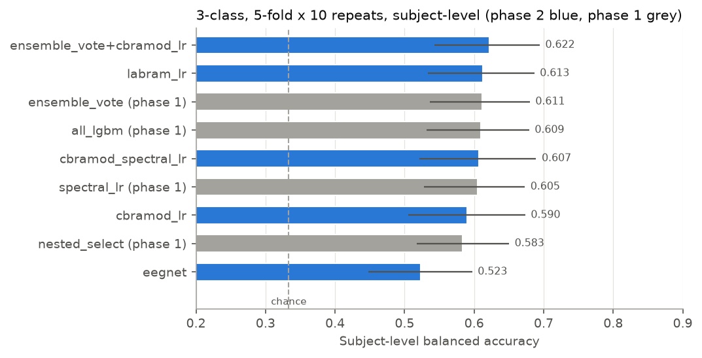
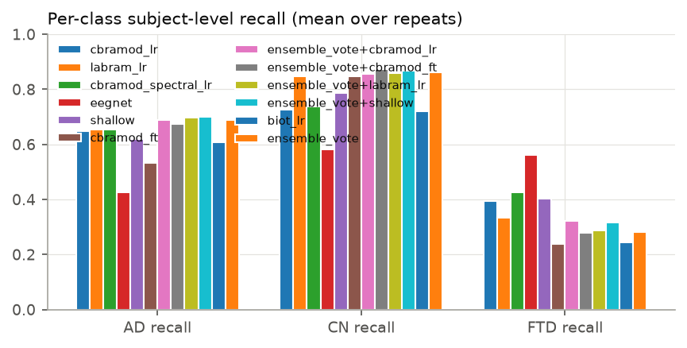
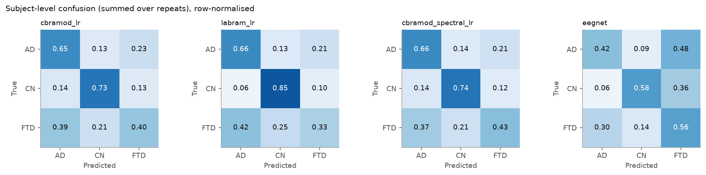
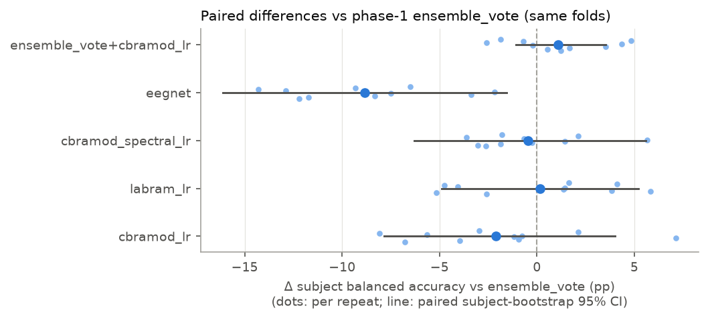
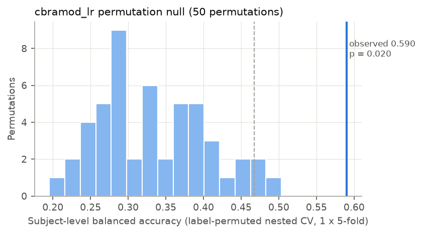

# Phase 2: deep models under the leak-free, subject-level harness

**Task:** 3-class AD / FTD / CN classification from resting-state EEG (OpenNeuro ds004504, 88 subjects: 36 AD, 29 CN, 23 FTD). The evaluation is **exactly phase 1's harness**:
- the same 10 × stratified-group 5-fold outer splits;
- the same seeds, average reference and 10 s / 5 s epochs (11,616 epochs);
- the same subject aggregation (softmax of the mean epoch log-probability) and metrics.

The phase-2 numbers are therefore directly comparable with `phase1_summary.md`.

**Pre-registration:** [`phase2_plan.md`](phase2_plan.md) was committed as `d651b4f` at 01:47:02 on 2026-09-27 and pushed straight away. The first outer-fold run started at 01:47:28. All results below come from `results/overhaul/phase2/` and were produced by `scripts/run_phase2.py` and `scripts/phase2_report.py`.

## TL;DR

- **No deep model beats the phase-1 feature models.**
  - The best single deep models are:
    - frozen **LaBraM** embeddings + logistic regression: **61.3 ± 2.5 %** [53.3, 68.7];
    - **ShallowFBCSPNet** trained from scratch: **60.3 ± 3.2 %** [52.2, 67.8].
  - Frozen **CBraMod** + LR, the pre-registered primary foundation model, reaches **59.0 ± 3.1 %** [50.5, 67.4].
  - All three are statistically indistinguishable from phase 1's `ensemble_vote` (**61.1 ± 3.0 %** [53.6, 68.0]) and `spectral_lr` (60.5 %). Paired subject-bootstrap 95 % CIs of the difference are about ±5-6 pp wide and all contain 0.
- **Three deep models are clearly worse:**

  | Model | Subject bal. acc. | Δ vs `ensemble_vote` | Paired 95 % CI |
  |---|---:|---:|---:|
  | EEGNet | 52.3 % | −8.8 pp | [−16.1, −1.6] |
  | Fine-tuned CBraMod | 54.0 % | −7.1 pp | [−13.3, −0.5] |
  | Frozen BIOT (exploratory) | 52.4 % | −8.7 pp | [−15.8, −1.6] |

  Fine-tuning the foundation model end to end on about 56 subjects per bag was worse than freezing it.
- **Hybrids add at most 1-2 pp, which cannot be demonstrated with 88 subjects.**
  - The pre-registered primary hybrid, phase-1 soft vote + `cbramod_lr` as a 4th member, reaches **62.2 ± 3.0 %** [54.3, 69.4]. That is Δ = +1.1 pp [−1.1, +3.5], P(Δ ≤ 0) = 0.18, so not distinguishable.
  - The post-hoc vote + ShallowFBCSPNet (the best end-to-end model, chosen after seeing cv3) reaches 62.9 ± 3.3 %, Δ = +1.8 pp [+0.1, +3.5], 7 of 10 repeats better.
    - This is the only comparison whose CI excludes 0. But it was selected after the fact, among roughly 13 comparisons, without multiplicity correction, and its lower bound is +0.1 pp.
    - **Treat it as a hypothesis for an independent dataset, not a finding.**
  - Feature-level concatenation of CBraMod embeddings with spectral features gives 60.7 %.
- **The FTD problem persists.**
  - FTD recall is 24-43 % for every deep model except EEGNet (phase 1: 26-45 %). EEGNet reaches 56 % FTD recall only by over-predicting FTD, which drops its AD recall to 42 %.
  - For the better models, CN recall is 73-85 % and CN one-vs-rest AUC is 0.86-0.90.
  - **AD vs FTD (binary):**
    - frozen CBraMod: 59.6 ± 4.1 %;
    - LaBraM: 55.3 %;
    - the hybrid: 57.8 %;
    - ShallowFBCSPNet: 62.2 ± 4.7 % [51.6, 72.1] (AUC 0.616), level with `rbp_lr`.

    Phase 1 reached 62.5 % (`rbp_lr`) and 60.0 % (`spectral_lr`). No deep representation separates AD from FTD better than relative band power.
- **Above chance:** a permutation test of the whole nested `cbramod_lr` pipeline gives a null of 33.4 ± 7.3 %, with a 95th percentile of 46.7 %. The observed value is 59.0 %, p = 0.020, which is the minimum possible with 50 permutations.
- **Legacy 18-subject split:** frozen LaBraM scores 71.6 % subject / 68.3 % epoch accuracy, against the old graph transformer's 63.6 % chunk accuracy. With 18 test subjects the CI is [49.5, 90.5], so this ranks nothing (see phase 1, section 6.3).
- **GPU:** about 6.5 h of GPU compute on the RTX 3080 Ti Laptop (the GPU was in use from 01:36 to 09:11).
  - There were **no pauses for Keshav's jobs**; nothing of his ran on the GPU overnight.
  - The guard paused twice for about 10 min each, both **self-inflicted**. One was a CPU-only helper process of mine that still loaded CUDA DLLs. The other was a false-positive utilisation sample right after one of my own folds, which is now fixed with a 30 s confirmation.

## 1. What was pre-registered, and deviations

The plan fixed the following before any outer-fold run:
- models, inputs, hyper-parameters (library or paper defaults), and training and early-stopping protocol;
- repeats: all 10;
- primary metric, primary comparator (`ensemble_vote`) and the paired-comparison decision rule ("better only if the paired bootstrap 95 % CI of Δ excludes 0");
- the analyses for AD vs FTD, the legacy split and the permutation test.

Deviations and additions, all reported:

1. **The ensemble + best end-to-end model** (`ensemble_vote+shallow`) is **post hoc**. The plan allowed it only "flagged as such". I also added `ensemble_vote+labram_lr` (+ the best deep model overall) post hoc. Both are marked `[post hoc]` in every table.
2. **The permutation test** was run with **50** permutations instead of 100, because it took 3.2 h on 12 CPU workers. See section 7.
3. **Frozen BIOT** was one of the optional extras (plan, section 7). Its result is exploratory. LaBraM fine-tuning, the other extra, was not run.
4. **Test location:** the plan says the bagging leakage check lives in `tests/test_leakage.py`. It is in `tests/test_deep.py`, which reuses that file's fixtures.
5. **The GPU runner was restarted once** (at 05:07, resuming from the per-fold checkpoint) to fix a guard false positive (section 9). No model setting changed. The one finished CBraMod fine-tuning fold was kept.

No setting of any model was changed after its outer-fold results were seen.

## 2. Models and pretrained weights

The implementations are from braindecode 1.8.1 (torch 2.11 + CUDA 12.8).

| name | what | input | trainable part |
|---|---|---|---|
| `cbramod_lr` (primary FM) | frozen CBraMod encoder; per-channel mean over ten 1-s patches of the final-layer tokens, giving 19 × 200 = 3,800 features per epoch | avg-ref, 200 Hz, µV/100 | L2 LR (phase-1 `lr_factory`, inner-CV C ∈ {1e-4 … 1}) |
| `labram_lr` | frozen LaBraM-Base encoder (final LayerNorm), same pooling (3,800) | same | same |
| `biot_lr` (exploratory) | frozen BIOT encoder, 256-d mean token | 16 TCP bipolar channels, each / its 95th percentile of \|x\| (authors' loader) | same |
| `cbramod_spectral_lr` | CBraMod embedding + 399 phase-1 spectral/aperiodic features | | same |
| `eegnet` | EEGNet v4, library defaults | 125 Hz, µV × 0.1 | whole network |
| `shallow` | ShallowFBCSPNet, library defaults | 250 Hz, µV × 0.1 | whole network |
| `cbramod_ft` | CBraMod + the authors' `avgpooling_patch_reps` head; authors' fine-tuning defaults (AdamW, backbone lr 1e-4, head lr 5e-4, weight decay 0.05, label smoothing 0.1, clip 1.0) | 200 Hz, µV/100 | whole network |
| `ensemble_vote+X` | phase-1 soft vote (spectral_lr + riemann_ts_lr + all_lgbm) with X as a 4th member (mean epoch log-probability) | | members tuned independently |

**End-to-end training** (identical for EEGNet, ShallowFBCSPNet and CBraMod fine-tuning):
- *5-fold subject bagging inside the outer-training subjects.* Each network trains on 4/5 of the outer-training subjects and is early-stopped on the remaining fifth, using subject/class-balanced validation cross-entropy with patience 8, or 4 for fine-tuning. The five networks' log-probabilities are averaged.
- Every training epoch draws 32 windows per subject, sampled with phase-1's balanced subject/class weights.
- AdamW with a cosine schedule, batch size 64, and no augmentation.
- `tests/test_deep.py` checks that the early-stopping subjects are always training subjects of the outer fold and that the five validation folds partition them.

**Weights** (all in `C:\AI\models\eeg-pretrained`, never committed):

| model | source | version | size | sha256 | licence |
|---|---|---|---:|---|---|
| CBraMod | https://huggingface.co/weighting666/CBraMod `pretrained_weights.pth` (linked from github.com/wjq-learning/CBraMod) | HF commit 500543c; code @ b9e9610 | 19.8 MB | 0792cb80…8157178 | code MIT; HF card Apache-2.0 |
| LaBraM-Base | github.com/935963004/LaBraM `checkpoints/labram-base.pth` (student encoder) | @ c431221 | 96.6 MB | 7c505838…c57c37c | MIT |
| BIOT | github.com/ycq091044/BIOT `pretrained-models/EEG-six-datasets-18-channels.ckpt` | @ d138e32 | 13.8 MB | 78ff15a1…228542 | MIT |
| (LaBraM parameter names) | huggingface.co/braindecode/labram-pretrained | @ 0563b6c | 23.3 MB | every tensor checked bit-identical to the official student weights at load time | BSD-3 (conversion) |

**Checks run before use:**
- **CBraMod:** the official HF file loads into braindecode's `CBraMod` with no missing or unexpected keys. It is tensor-identical to `braindecode/cbramod-pretrained`, and its output equals the official repository's model on random input (max |Δ| = 0.0).
  - **Caveat for braindecode users:** braindecode's `return_encoder_output=True` still applies the pretraining reconstruction head `proj_out`. The authors' downstream code replaces `proj_out` with the identity, and so does ours.
- **LaBraM:** braindecode's `Labram` (built for 10 patches, with the temporal embedding truncated exactly as the official code slices it) equals the official `NeuralTransformer` token outputs (max |Δ| = 0.0).
- **BIOT:** braindecode's `BIOT` encoder equals the official `BIOTEncoder` (max |Δ| = 0.0).
- **EEGPT was not used.**
  - The official checkpoint is only on a figshare private link, which refuses scripted download.
  - braindecode's re-hosted `eegpt-pretrained` has a config (62 channels, 250 Hz, 1,000 samples) that does not match the official checkpoint (58 channels, 256 Hz, 4 s), so its provenance cannot be verified.

## 3. Main result: 3-class, 5-fold × 10 repeats, all 88 subjects

Each cell is mean ± SD over the 10 repeats, with the class-stratified subject-bootstrap 95 % CI (2,000 resamples) in brackets. Chance is 33.3 %. The CSV is `phase2/tables/cv3.csv`.

| model | repeats | subject bal. acc. % (sd) [95% CI] | subject acc. % | subject macro-F1 % | subject macro AUC [95% CI] | recall AD/CN/FTD % | epoch bal. acc. % | epoch acc. % | compute (min) |
|---|---:|---:|---:|---:|---:|---:|---:|---:|---:|
| cbramod_lr | 10 | 59.0 ± 3.1 [50.5, 67.4] | 60.8 ± 3.0 | 58.9 ± 3.2 | 0.738 ± 0.032 [0.662, 0.807] | 65/73/40 | 56.1 ± 2.7 | 58.1 ± 2.3 | 34.8 |
| labram_lr | 10 | 61.3 ± 2.5 [53.3, 68.7] | 63.5 ± 1.7 | 60.1 ± 2.9 | 0.757 ± 0.019 [0.688, 0.822] | 66/85/33 | 57.3 ± 1.3 | 59.9 ± 0.9 | 36.3 |
| cbramod_spectral_lr | 10 | 60.7 ± 2.7 [52.1, 68.9] | 62.3 ± 2.6 | 60.5 ± 2.7 | 0.750 ± 0.025 [0.673, 0.818] | 66/74/43 | 57.3 ± 2.4 | 59.3 ± 2.1 | 40.6 |
| eegnet | 10 | 52.3 ± 2.6 [44.8, 59.7] | 51.2 ± 2.5 | 51.8 ± 2.4 | 0.728 ± 0.021 [0.664, 0.787] | 42/58/56 | 50.6 ± 1.5 | 49.3 ± 1.7 | 79.0 |
| shallow | 10 | 60.3 ± 3.2 [52.2, 67.8] | 61.8 ± 2.8 | 59.6 ± 3.4 | 0.774 ± 0.023 [0.701, 0.836] | 62/79/40 | 57.7 ± 1.9 | 59.6 ± 1.5 | 79.1 |
| cbramod_ft | 10 | 54.0 ± 2.9 [47.0, 61.1] | 56.0 ± 3.0 | 51.8 ± 2.7 | 0.686 ± 0.016 [0.616, 0.748] | 53/85/24 | 51.6 ± 1.6 | 54.1 ± 1.8 | 131.2 |
| ensemble_vote+cbramod_lr | 10 | 62.2 ± 3.0 [54.3, 69.4] | 64.8 ± 2.5 | 61.0 ± 3.6 | 0.783 ± 0.025 [0.713, 0.845] | 69/86/32 | 59.3 ± 2.4 | 62.7 ± 1.9 | 0.0 |
| ensemble_vote+cbramod_ft | 10 | 60.9 ± 4.1 [53.3, 67.8] | 63.6 ± 4.0 | 59.1 ± 4.5 | 0.785 ± 0.017 [0.712, 0.849] | 68/87/28 | 59.2 ± 2.0 | 62.8 ± 1.7 | 0.0 |
| ensemble_vote+labram_lr [post hoc] | 10 | 61.4 ± 3.2 [53.7, 68.2] | 64.3 ± 3.0 | 60.0 ± 3.7 | 0.783 ± 0.017 [0.710, 0.845] | 70/86/29 | 59.5 ± 1.7 | 63.0 ± 1.3 | 0.0 |
| ensemble_vote+shallow [post hoc] | 10 | 62.9 ± 3.3 [55.3, 69.9] | 65.6 ± 3.1 | 61.6 ± 3.9 | 0.792 ± 0.019 [0.719, 0.856] | 70/87/32 | 60.3 ± 1.9 | 63.6 ± 1.5 | 0.0 |
| biot_lr | 10 | 52.4 ± 4.7 [44.5, 60.3] | 55.0 ± 4.5 | 51.5 ± 4.8 | 0.676 ± 0.022 [0.605, 0.744] | 61/72/24 | 49.0 ± 2.6 | 51.7 ± 2.3 | 15.4 |
| ensemble_vote (phase 1) | 10 | 61.1 ± 3.0 [53.6, 68.0] | 64.0 ± 2.8 | 59.6 ± 3.5 | 0.786 ± 0.018 [0.715, 0.848] | 69/86/28 | 59.5 ± 1.9 | 63.1 ± 1.6 | 110.5 |
| all_lgbm (phase 1) | 10 | 60.9 ± 2.3 [53.2, 67.9] | 64.2 ± 1.9 | 59.1 ± 3.1 | 0.776 ± 0.008 [0.704, 0.843] | 72/86/26 | 58.4 ± 1.4 | 62.4 ± 0.8 | 41.9 |
| spectral_lr (phase 1) | 10 | 60.5 ± 3.3 [52.8, 67.3] | 62.4 ± 3.3 | 59.6 ± 3.3 | 0.757 ± 0.021 [0.689, 0.820] | 64/81/37 | 57.3 ± 1.5 | 59.6 ± 1.6 | 5.3 |
| all_lr (phase 1) | 10 | 60.4 ± 3.3 [53.3, 67.2] | 62.3 ± 3.2 | 59.2 ± 3.5 | 0.755 ± 0.026 [0.691, 0.815] | 62/84/34 | 57.4 ± 2.0 | 60.1 ± 1.5 | 14.7 |
| nested_select (phase 1) | 10 | 58.3 ± 3.6 [51.7, 65.0] | 60.7 ± 3.8 | 57.2 ± 3.8 | 0.742 ± 0.030 [0.679, 0.799] | 64/80/31 | 55.2 ± 2.5 | 57.7 ± 2.7 | 117.8 |
| rbp_lr (phase 1) | 10 | 58.5 ± 2.4 [51.0, 65.8] | 60.8 ± 2.0 | 57.4 ± 2.8 | 0.756 ± 0.014 [0.694, 0.820] | 64/79/32 | 54.0 ± 1.6 | 56.5 ± 1.6 | 0.7 |

- `biot_lr` is exploratory (plan, section 7).
- `[post hoc]` marks a vote member chosen after the cv3 results were seen.
- For the votes, "compute" is 0 because they are built from the members' saved outer-fold predictions. The members' compute is listed in their own rows.



 

**Reading the table**

- **Frozen foundation-model features behave like hand-crafted spectral features.**
  - LaBraM + LR (61.3 %) and CBraMod + LR (59.0 %) sit inside phase 1's 58-61 % band.
  - Their per-class pattern is the same: CN is easy (recall 73-85 %, AUC 0.86-0.90) and FTD is hard (recall 33-40 %, AUC 0.62-0.63).
  - Concatenating CBraMod with the 399 spectral features gives 60.7 %, i.e. the embedding adds nothing measurable to the spectra, or vice versa.
- **The best end-to-end network is ShallowFBCSPNet (60.3 %, macro AUC 0.774, the highest single-model AUC in phase 2).**
  - This network is a learned filter bank → spatial filter → squaring → log-average-power pipeline, i.e. a learned band-power model.
  - Its early stopping picked epoch 2 in half the bags (median 2, IQR 2-3). It works best when it has barely moved from a smooth band-power extractor and memorises subjects soon after.
- **EEGNet (52.3 %) over-predicts FTD** (FTD recall 56 %, AD recall 42 %). Its AUCs (AD 0.73, CN 0.87) are close to the others, but its decision thresholds are poor.
- **Fine-tuned CBraMod (54.0 %) is worse than frozen CBraMod (59.0 %).**
  - Validation loss bottoms out after 2-5 short epochs (median 3), and the fine-tuned model almost never predicts FTD (recall 24 %).
  - With about 56 training subjects per bag, full fine-tuning of 4.9 M parameters overfits subject identity. A frozen encoder + linear head is the more robust use of a foundation model at this sample size, as the phase-1 summary predicted.
- **Inner-CV choice of C for the 3,800-dimensional LR heads.** The smallest C in the pre-registered grid (1e-4) was chosen in 30 of 50 folds for CBraMod and 18 of 50 for LaBraM. Stronger regularisation might have helped, but the grid was fixed in advance and was not extended after seeing this.
- **Epoch-level metrics are 2-4 pp below subject level**, as in phase 1.

## 4. Paired comparison with phase 1 on identical folds

- Δ = phase-2 model − phase-1 model in subject balanced accuracy.
- "Repeats better" counts the repeats in which the phase-2 model was higher.
- The CI is a paired, class-stratified bootstrap over subjects (2,000 resamples; each resample evaluates both models on the same drawn subjects in every repeat and averages over repeats).
- Repeats share the same 88 subjects, so the per-repeat SD is descriptive only.
- The pre-registered rule is: "better" or "worse" only if the CI excludes 0.

**vs `ensemble_vote` (phase-1 best, primary comparator)**

| model | vs | repeats | mean Δ bal. acc. (pp) | sd of per-repeat Δ (pp) | repeats better / equal | paired bootstrap 95% CI (pp) | P(Δ ≤ 0) | verdict |
|---|---:|---:|---:|---:|---:|---:|---:|---:|
| cbramod_lr | ensemble_vote | 10 | -2.1 | 4.5 | 2 / 0 of 10 | [-7.8, +4.0] | 0.772 | not distinguishable |
| labram_lr | ensemble_vote | 10 | +0.2 | 4.0 | 6 / 0 of 10 | [-4.9, +5.2] | 0.471 | not distinguishable |
| cbramod_spectral_lr | ensemble_vote | 10 | -0.5 | 2.8 | 3 / 0 of 10 | [-6.3, +5.6] | 0.575 | not distinguishable |
| eegnet | ensemble_vote | 10 | -8.8 | 4.1 | 0 / 0 of 10 | [-16.1, -1.6] | 0.992 | worse |
| shallow | ensemble_vote | 10 | -0.8 | 3.8 | 4 / 0 of 10 | [-6.1, +4.8] | 0.623 | not distinguishable |
| cbramod_ft | ensemble_vote | 10 | -7.1 | 3.3 | 0 / 0 of 10 | [-13.3, -0.5] | 0.982 | worse |
| ensemble_vote+cbramod_lr | ensemble_vote | 10 | +1.1 | 2.5 | 6 / 0 of 10 | [-1.1, +3.5] | 0.175 | not distinguishable |
| ensemble_vote+cbramod_ft | ensemble_vote | 10 | -0.3 | 1.8 | 4 / 2 of 10 | [-1.2, +0.8] | 0.679 | not distinguishable |
| ensemble_vote+labram_lr [post hoc] | ensemble_vote | 10 | +0.3 | 2.5 | 5 / 1 of 10 | [-2.3, +2.7] | 0.395 | not distinguishable |
| ensemble_vote+shallow [post hoc] | ensemble_vote | 10 | +1.8 | 2.4 | 7 / 0 of 10 | [+0.1, +3.5] | 0.022 | better |
| biot_lr | ensemble_vote | 10 | -8.7 | 4.6 | 0 / 0 of 10 | [-15.8, -1.6] | 0.993 | worse |

**vs `spectral_lr` (phase-1 single LR on spectral features)**

| model | vs | repeats | mean Δ bal. acc. (pp) | sd of per-repeat Δ (pp) | repeats better / equal | paired bootstrap 95% CI (pp) | P(Δ ≤ 0) | verdict |
|---|---:|---:|---:|---:|---:|---:|---:|---:|
| cbramod_lr | spectral_lr | 10 | -1.5 | 5.5 | 4 / 0 of 10 | [-8.7, +5.3] | 0.667 | not distinguishable |
| labram_lr | spectral_lr | 10 | +0.8 | 3.7 | 7 / 0 of 10 | [-4.8, +5.8] | 0.385 | not distinguishable |
| cbramod_spectral_lr | spectral_lr | 10 | +0.1 | 5.3 | 6 / 0 of 10 | [-6.8, +6.9] | 0.501 | not distinguishable |
| eegnet | spectral_lr | 10 | -8.2 | 5.0 | 0 / 0 of 10 | [-15.8, -0.7] | 0.985 | worse |
| shallow | spectral_lr | 10 | -0.2 | 5.4 | 6 / 0 of 10 | [-6.7, +6.0] | 0.538 | not distinguishable |
| cbramod_ft | spectral_lr | 10 | -6.5 | 5.7 | 1 / 0 of 10 | [-13.5, +0.5] | 0.963 | not distinguishable |
| ensemble_vote+cbramod_lr | spectral_lr | 10 | +1.7 | 5.5 | 7 / 0 of 10 | [-2.9, +6.2] | 0.263 | not distinguishable |
| ensemble_vote+cbramod_ft | spectral_lr | 10 | +0.4 | 6.3 | 5 / 0 of 10 | [-4.0, +4.9] | 0.457 | not distinguishable |
| ensemble_vote+labram_lr [post hoc] | spectral_lr | 10 | +0.9 | 5.8 | 6 / 0 of 10 | [-3.4, +5.4] | 0.360 | not distinguishable |
| ensemble_vote+shallow [post hoc] | spectral_lr | 10 | +2.4 | 6.1 | 7 / 0 of 10 | [-2.2, +6.9] | 0.179 | not distinguishable |
| biot_lr | spectral_lr | 10 | -8.1 | 6.2 | 1 / 0 of 10 | [-14.7, -1.7] | 0.992 | worse |



- **Nothing beats phase 1 in a pre-registered comparison.**
  - The primary FM model `cbramod_lr` is −2.1 pp [−7.8, +4.0].
  - The primary hybrid `ensemble_vote+cbramod_lr` is +1.1 pp [−1.1, +3.5], P(Δ ≤ 0) = 0.18.
- **The only positive CI is post hoc.** `ensemble_vote+shallow` is +1.8 pp [+0.1, +3.5]. It is one of about 13 comparisons against `ensemble_vote`, with no multiplicity correction, and ShallowNet was chosen *because* it was the best end-to-end model.
- **A useful by-product:** paired CIs for 4-member votes against the 3-member vote are narrow, ±2 pp, because the predictions are highly correlated. Small ensemble gains are therefore measurable in principle, but they would need replication on independent subjects.

## 5. AD vs FTD (binary, 5-fold × 10 repeats, 59 subjects)

| model | repeats | subject bal. acc. % (sd) [95% CI] | subject acc. % | sens AD / spec FTD % | subject AUC [95% CI] | epoch bal. acc. % | compute (min) |
|---|---:|---:|---:|---:|---:|---:|---:|
| cbramod_lr | 10 | 59.6 ± 4.1 [49.6, 70.4] | 62.2 ± 3.8 | 71 / 48 | 0.597 ± 0.048 [0.469, 0.731] | 57.6 ± 2.9 | 17.0 |
| labram_lr | 10 | 55.3 ± 3.9 [44.3, 66.1] | 58.1 ± 3.4 | 68 / 42 | 0.595 ± 0.057 [0.461, 0.723] | 55.5 ± 3.4 | 21.1 |
| cbramod_spectral_lr | 10 | 57.8 ± 3.3 [47.9, 68.4] | 60.5 ± 3.7 | 70 / 46 | 0.599 ± 0.045 [0.472, 0.731] | 57.2 ± 2.8 | 20.3 |
| shallow | 10 | 62.2 ± 4.7 [51.6, 72.1] | 64.1 ± 4.8 | 71 / 53 | 0.616 ± 0.042 [0.476, 0.749] | 58.8 ± 2.9 | 86.8 |
| rbp_lr (phase 1) | 10 | 62.5 ± 3.3 [52.0, 72.6] | 63.4 ± 3.0 | 66 / 59 | 0.645 ± 0.043 [0.522, 0.758] | 58.5 ± 2.5 | 0.4 |
| spectral_lr (phase 1) | 10 | 60.0 ± 4.4 [50.0, 70.2] | 61.9 ± 4.0 | 69 / 51 | 0.599 ± 0.041 [0.476, 0.724] | 58.3 ± 3.5 | 1.3 |

Paired against phase 1 on identical folds:

| model | vs | repeats | mean Δ bal. acc. (pp) | sd of per-repeat Δ (pp) | repeats better / equal | paired bootstrap 95% CI (pp) | P(Δ ≤ 0) | verdict |
|---|---:|---:|---:|---:|---:|---:|---:|---:|
| cbramod_lr | rbp_lr | 10 | -2.9 | 4.3 | 3 / 0 of 10 | [-13.1, +7.3] | 0.684 | not distinguishable |
| cbramod_lr | spectral_lr | 10 | -0.4 | 5.7 | 4 / 0 of 10 | [-9.1, +8.4] | 0.500 | not distinguishable |
| labram_lr | rbp_lr | 10 | -7.3 | 4.3 | 0 / 0 of 10 | [-17.4, +2.7] | 0.921 | not distinguishable |
| labram_lr | spectral_lr | 10 | -4.7 | 5.0 | 1 / 0 of 10 | [-12.7, +3.2] | 0.879 | not distinguishable |
| cbramod_spectral_lr | rbp_lr | 10 | -4.7 | 4.2 | 2 / 0 of 10 | [-14.6, +5.1] | 0.815 | not distinguishable |
| cbramod_spectral_lr | spectral_lr | 10 | -2.1 | 4.7 | 2 / 0 of 10 | [-10.3, +5.7] | 0.671 | not distinguishable |
| shallow | rbp_lr | 10 | -0.4 | 5.5 | 6 / 0 of 10 | [-9.4, +8.8] | 0.525 | not distinguishable |
| shallow | spectral_lr | 10 | +2.2 | 5.4 | 7 / 0 of 10 | [-6.0, +10.2] | 0.292 | not distinguishable |

The phase-2 frozen-embedding models are 55-60 % (AUC about 0.60). ShallowFBCSPNet, trained as a binary model, is 62.2 ± 4.7 % [51.6, 72.1] (AUC 0.616), level with `rbp_lr`. None is better than phase 1's relative band power (62.5 %, AUC 0.645).

Paired CIs against `rbp_lr` are ±10 pp wide (`phase2/tables/paired_cv_ad_ftd.md`). **There is no evidence that any deep representation carries AD-vs-FTD information beyond band power** at this sample size.

## 6. Legacy 18-subject split vs the old graph transformer

The split is the same 70 train / 18 test subjects as the April 2025 model (7 AD, 6 CN, 5 FTD), with a single fit, so the subject-level CIs are about ±20 pp.

| model | repeats | subject bal. acc. % (sd) [95% CI] | subject acc. % | subject macro-F1 % | subject macro AUC [95% CI] | recall AD/CN/FTD % | epoch bal. acc. % | epoch acc. % | compute (min) |
|---|---:|---:|---:|---:|---:|---:|---:|---:|---:|
| cbramod_lr | 1 | 53.8 [31.2, 76.3] | 55.6 | 54.4 | 0.768 [0.567, 0.925] | 71/50/40 | 55.4 | 56.6 | 2.3 |
| labram_lr | 1 | 71.6 [49.5, 90.5] | 72.2 | 71.3 | 0.875 [0.712, 0.981] | 71/83/60 | 67.2 | 68.3 | 2.3 |
| cbramod_spectral_lr | 1 | 53.8 [31.7, 76.3] | 55.6 | 54.4 | 0.787 [0.611, 0.938] | 71/50/40 | 55.2 | 56.4 | 2.5 |
| eegnet | 1 | 66.0 [43.5, 87.8] | 66.7 | 66.0 | 0.808 [0.623, 0.951] | 71/67/60 | 59.6 | 60.3 | 0.7 |
| shallow | 1 | 65.7 [47.6, 83.8] | 66.7 | 63.7 | 0.869 [0.724, 0.974] | 57/100/40 | 65.8 | 66.8 | 0.8 |
| cbramod_ft | 1 | 47.6 [38.1, 61.9] | 50.0 | 40.4 | 0.680 [0.529, 0.801] | 43/100/0 | 47.3 | 48.8 | 2.2 |
| ensemble_vote+cbramod_lr | 1 | 59.4 [37.3, 81.1] | 61.1 | 59.8 | 0.795 [0.608, 0.951] | 71/67/40 | 65.7 | 66.8 | 0.0 |
| ensemble_vote+cbramod_ft | 1 | 59.4 [36.5, 81.9] | 61.1 | 59.3 | 0.809 [0.620, 0.952] | 71/67/40 | 64.5 | 65.4 | 0.0 |
| ensemble_vote+labram_lr [post hoc] | 1 | 64.9 [43.2, 84.9] | 66.7 | 64.8 | 0.879 [0.715, 0.986] | 71/83/40 | 68.6 | 69.8 | 0.0 |
| ensemble_vote+shallow [post hoc] | 1 | 69.7 [48.2, 87.8] | 72.2 | 69.4 | 0.836 [0.647, 0.982] | 86/83/40 | 68.3 | 69.4 | 0.0 |
| biot_lr | 1 | 43.2 [21.4, 64.9] | 44.4 | 41.9 | 0.716 [0.505, 0.885] | 43/67/20 | 48.8 | 49.3 | 1.2 |
| ensemble_vote (phase 1) | 1 | 59.4 [36.5, 81.9] | 61.1 | 59.3 | 0.809 [0.620, 0.964] | 71/67/40 | 65.7 | 66.7 | 6.6 |
| all_lgbm (phase 1) | 1 | 69.7 [48.2, 87.8] | 72.2 | 69.4 | 0.848 [0.659, 0.977] | 86/83/40 | 67.7 | 68.8 | 2.1 |
| spectral_lr (phase 1) | 1 | 66.8 [45.1, 85.7] | 66.7 | 66.2 | 0.903 [0.777, 0.986] | 57/83/60 | 67.0 | 67.4 | 0.4 |
| all_lr (phase 1) | 1 | 72.7 [50.2, 90.5] | 72.2 | 72.8 | 0.816 [0.636, 0.961] | 71/67/80 | 62.0 | 62.4 | 0.7 |
| nested_select (phase 1) | 1 | 72.7 [50.2, 90.5] | 72.2 | 72.8 | 0.816 [0.636, 0.961] | 71/67/80 | 62.0 | 62.4 | 5.2 |
| rbp_lr (phase 1) | 1 | 64.1 [42.4, 83.3] | 66.7 | 63.7 | 0.781 [0.588, 0.939] | 86/67/40 | 52.4 | 53.8 | 0.2 |

- **Old model, for reference:** 63.6 % accuracy and 62.2 % balanced accuracy at chunk level (15 s chunks, native reference, z-scored). Its AUCs were AD 0.79, CN 0.84 and FTD 0.65.
- **Epoch-level phase-2 results:**
  - frozen LaBraM + LR: 68.3 % accuracy, AUC AD 0.87 / CN 0.92 / FTD 0.77;
  - ShallowFBCSPNet: 66.8 %;
  - EEGNet: 60.3 %;
  - frozen CBraMod: 56.6 %;
  - fine-tuned CBraMod: 48.8 %.
- The ranking on this split disagrees with the 10-repeat CV. For example, CBraMod + LR is 53.8 % here against 59.0 % in CV, and LaBraM is 71.6 % against 61.3 %. As phase 1 showed, a single 18-subject split cannot rank models.

## 7. Permutation test

`cbramod_lr`, the pre-registered primary foundation model, was tested with a subject-label permutation of the **whole nested pipeline**: inner-CV choice of C, the scaler and the LR, one 5-fold CV per permutation, as for phase-1 `spectral_lr`.

- **Result:** with **50 permutations**, the null has mean 33.4 ± 7.3 % and a 95th percentile of 46.7 %.
- **Observed:** 10-repeat mean 59.0 %, **p = 0.020**. This is 1/51, the smallest p-value 50 permutations allow; no permuted run reached the observed value.
- **Cost:** 3.2 h on 12 CPU workers. The permuted-label LR fits converge slowly, so this took about twice the expected time. 100 permutations would not have fitted the budget.
- **Other models:** the null is essentially model-independent, since it depends on the class balance and the number of subjects. Phase 1's nulls had 95th percentiles of 42.7-44.1 %. Every phase-2 model (≥ 52.3 %) is therefore well above chance. EEGNet and BIOT, the weakest, were not permutation-tested themselves.
- The raw values are in `phase2/permutation/cbramod_lr.json`.



## 8. Training diagnostics

- **Early-stopping epoch** (the best validation epoch in each of the 250 bags per model; an "epoch" = 32 windows per training subject; full histories are in `phase2/logs/train_history_*.jsonl`):

  | Model | Median | IQR | Max |
  |---|---:|---:|---:|
  | EEGNet | 7 | 5-9 | 28 |
  | ShallowFBCSPNet | 2 | 2-3 | 12 |
  | CBraMod fine-tuning | 3 | 2-5 | 13 |

- **Training vs validation loss:**
  - The CNNs keep lowering training loss after validation loss has turned. The median training cross-entropy when training stopped was 0.30 for EEGNet and 0.14 for ShallowFBCSPNet, against about 0.56 and 0.90 at the best validation epoch. The networks learn to recognise the training *subjects*, which does not transfer to new subjects. This is the core small-n problem: about 56 subjects per bag and 70 per outer fold.
  - Fine-tuned CBraMod never fits the training data well (label-smoothed training loss about 0.87 at stop), yet its validation loss still gets worse after 2-5 epochs. Updating the pretrained encoder moves it away from a representation that transferred better frozen.
- **Calibration:** the subject-level log-loss of the LR heads on 3,800-dimensional embeddings is poor (1.4-1.5 vs about 1.0 for the networks and the ensemble). This is because geometric-mean aggregation over about 130 correlated epochs is overconfident. Balanced accuracy and AUC are unaffected, but these probabilities should not be read as calibrated risks.
- **Seeds:**
  - outer splits: 2026 + 1000·repeat;
  - model: 2026 + 17·repeat + fold;
  - bag b: + 7919·b.

  cuDNN is deterministic. GPU reductions can still differ in the last bits between runs.

## 9. Compute and GPU etiquette

| run | outer folds | GPU compute (min) |
|---|---:|---:|
| timing smoke tests (training subjects of one fold only) | - | about 8 |
| frozen CBraMod + LaBraM embeddings, all 11,616 epochs | - | under 1 |
| EEGNet cv3 | 50 | 79 |
| ShallowFBCSPNet cv3 | 50 | 79 |
| CBraMod fine-tuning cv3 | 50 | 131 |
| legacy split (3 networks) | 3 | 4 |
| ShallowFBCSPNet AD vs FTD | 50 | 87 |
| **total** | | **about 390 (6.5 h)** |

- CPU work ran at below-normal priority, with 4-12 worker processes: the LR heads (about 35-40 min per model per 50 folds), BIOT embedding extraction and the permutation test.
- While 10-12 CPU workers ran at the same time, GPU folds took 2-3× longer (EEGNet about 100 s instead of about 40 s per fold). These small networks are limited by CPU-side batch preparation and Python overhead, not by the GPU.

**GPU etiquette.** `GpuGuard` ran `C:\AI\bin\model-status.cmd` and `nvidia-smi` before each of the 203 outer folds and at most every 5 min inside training.

- **Keshav's jobs:** no Ollama model, no other CUDA process, no WSL job, no game or emulator and no new Docker container appeared all night. The pre-existing `quirky_bell` swebench container is CPU-only and was ignored. **No pause was caused by Keshav's work.**
- **Two self-inflicted pauses** (`phase2/gpu_pauses.jsonl`):
  1. **04:10, 10.3 min.** My CPU-only BIOT embedding extraction (`CUDA_VISIBLE_DEVICES=-1`) still loaded the CUDA DLLs through `import torch`, so `model-status` listed it as a "Python GPU job". The guard correctly treated it as a foreign process and waited.
  2. **04:58, about 9 min.** The GPU-utilisation sample taken right after one of my own folds finished (17 %) still contained my own load. The runner was stopped (by PID) and restarted at 05:07 from its per-fold checkpoint. The guard now re-checks utilisation-only reasons after 30 s. No false positive recurred in the remaining 102 GPU folds.

## 10. Interpretation

1. **With 88 subjects, deep models do not beat hand-crafted spectral features**, and every difference within about 5 pp is undemonstrable, as phase 1 predicted.
   - The best deep numbers (LaBraM + LR 61.3 %, ShallowFBCSPNet 60.3 %, votes 62-63 %) are within 1-2 pp of `ensemble_vote` (61.1 %).
   - The models that differ significantly are all *worse* (EEGNet, fine-tuned CBraMod, BIOT).
2. **What works is what looks like band power.**
   - ShallowFBCSPNet is a learned band-power model, and early stopping kept it close to that.
   - The frozen foundation-model embeddings are dominated by spectral content: adding them to the spectral features changes nothing.
   - The information the classifiers use is the EEG slowing that phase 1 characterised.
3. **Foundation models: freeze, don't fine-tune, at this n.**
   - The frozen LaBraM and CBraMod encoders with a regularised linear head are as good as the best feature model and cost about 30 s of GPU for the whole dataset.
   - Full fine-tuning lost 5 pp.
   - Parameter-efficient fine-tuning or pooling across many public EEG datasets (more *subjects*) is the only route likely to change this.
4. **FTD remains the bottleneck.** No representation lifts FTD recall above about 43 %, or AD-vs-FTD above phase 1's 62.5 %. A clinically useful FTD detector will need more FTD subjects or other modalities, not another architecture.
5. **Ensembles:** adding a deep member to the phase-1 vote changes it by −0.3 to +1.8 pp.
   - Frozen CBraMod: +1.1 pp, better in 6 of 10 repeats.
   - ShallowFBCSPNet: +1.8 pp, 7 of 10.
   - LaBraM: +0.3 pp.
   - Fine-tuned CBraMod: −0.3 pp.

   A diverse, reasonably good deep member (ShallowFBCSPNet) is the most promising lead, but it is post hoc and marginal. It should be pre-registered and tested on external data (for example another AD/FTD EEG cohort) before anyone claims it.

## 11. Issues found (please check)

- **Phase-1 summary epoch counts are wrong in the text** (the phase-1 results themselves are fine).
  - The text says 187 amplitude-rejected windows and 11,796 epochs (4,929 AD / 4,075 CN / 2,792 FTD), with 40-227 per subject.
  - The cached data that every phase-1 and phase-2 model used has **367 amplitude-rejected windows and 11,616 epochs (4,852 / 4,012 / 2,752), with 40-225 per subject**. Every phase-1 `summary.json` also says `n_epochs = 11616`.
  - The text is corrected in this commit.
- **braindecode's `CBraMod(return_encoder_output=True)`** applies the pretraining head `proj_out`, unlike the authors' downstream usage. We remove it. This is worth an upstream issue.
- **braindecode's `Labram.from_pretrained("braindecode/labram-pretrained")`** is configured for 15 patches (`n_times = 3000`) and fails on 10 s / 200 Hz input. We build the model for 10 patches and slice the temporal embedding as the official code does.
- **`model-status` counts any Python process that has loaded CUDA DLLs as a GPU job**, even with `CUDA_VISIBLE_DEVICES=-1`. `import torch` is enough. My own CPU-only helper therefore triggered one pause.

## 12. Reproduction

```bash
uv sync --extra deep --extra cu128        # or: --extra deep --extra cpu (no GPU)
uv run pytest                             # 27 tests
# frozen embeddings are computed on first use and cached (C:\AI\datasets\cache\embeddings)
uv run python scripts/run_phase2.py --task cv3 --models eegnet,shallow,cbramod_ft --gpu
uv run python scripts/run_phase2.py --task cv3 --models cbramod_lr,labram_lr,cbramod_spectral_lr,biot_lr --n-jobs 10
uv run python scripts/run_phase2.py --task legacy --models ... [--gpu]
uv run python scripts/run_phase2.py --task cv_ad_ftd --models cbramod_lr,labram_lr,cbramod_spectral_lr --n-jobs 10
uv run python scripts/run_phase2.py --task cv_ad_ftd --models shallow --gpu
uv run python scripts/permutation_test.py --phase2 --model cbramod_lr --n-perm 50 --n-jobs 12
uv run python scripts/phase2_report.py --posthoc-members labram_lr,shallow
```

- Weights are downloaded on first use from the URLs in `eegdementia/deep.py` (`PRETRAINED`) and checked against their sha256. Set `EEG_WEIGHTS_DIR` to change the location.
- GPU runs are sequential and checkpointed per outer fold (`C:\AI\datasets\cache\phase2_ckpt`), so an interrupted run resumes. `GpuGuard` (`eegdementia/gpu_guard.py`) runs before every fold and every 5 min during training.

## References

- Wang, J., et al. (2025). CBraMod: A Criss-Cross Brain Foundation Model for EEG Decoding. *ICLR 2025*. arXiv:2412.07236.
- Jiang, W.-B., Zhao, L.-M., & Lu, B.-L. (2024). Large Brain Model for Learning Generic Representations with Tremendous EEG Data in BCI (LaBraM). *ICLR 2024*. arXiv:2405.18765.
- Yang, C., Westover, M. B., & Sun, J. (2023). BIOT: Biosignal Transformer for Cross-data Learning in the Wild. *NeurIPS 2023*. arXiv:2305.10351.
- Lawhern, V. J., et al. (2018). EEGNet. *J. Neural Eng.* 15, 056013.
- Schirrmeister, R. T., et al. (2017). Deep learning with convolutional neural networks for EEG decoding and visualization (ShallowFBCSPNet). *Hum. Brain Mapp.* 38, 5391-5420.
- Aristimunha, B., et al. braindecode 1.8.1, https://braindecode.org.
- Dataset and phase-1 references: see `phase1_summary.md`.
