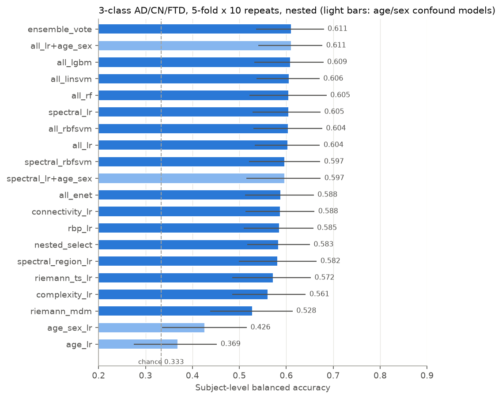
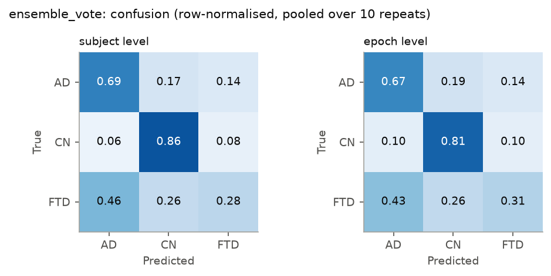
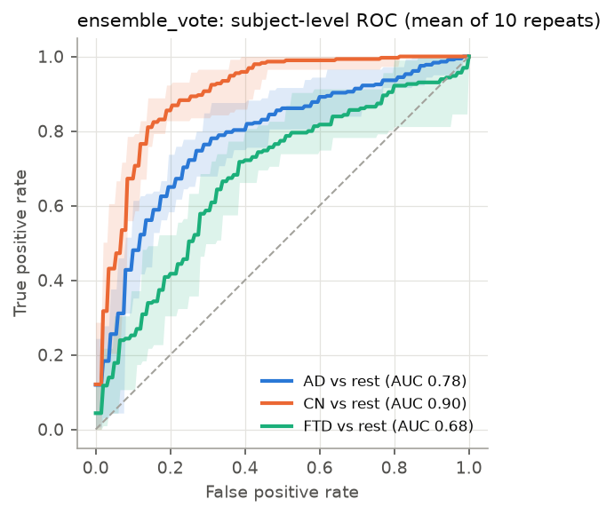
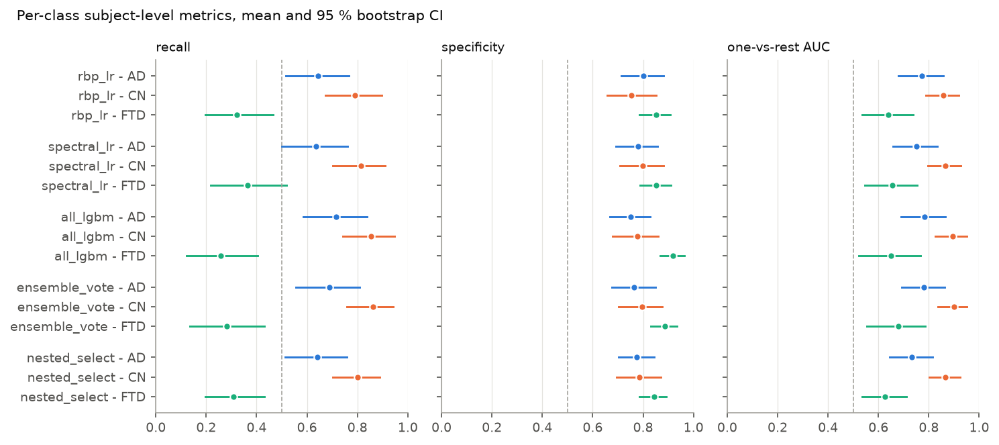
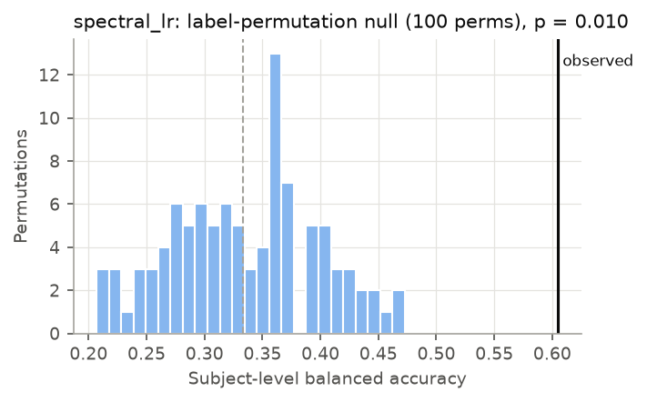
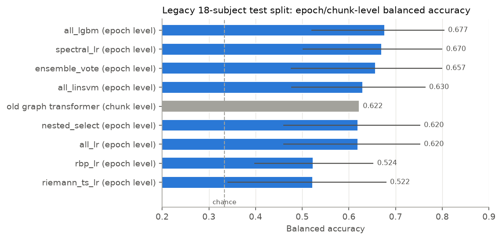
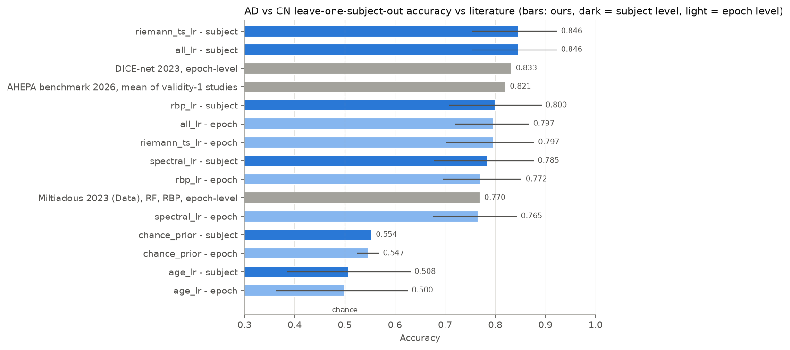
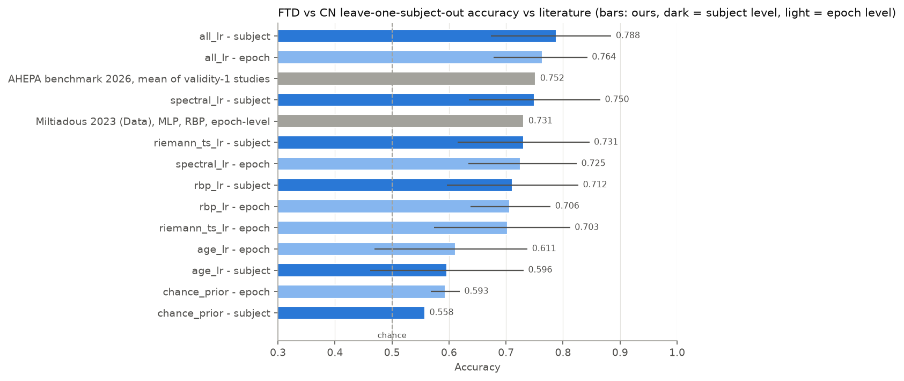
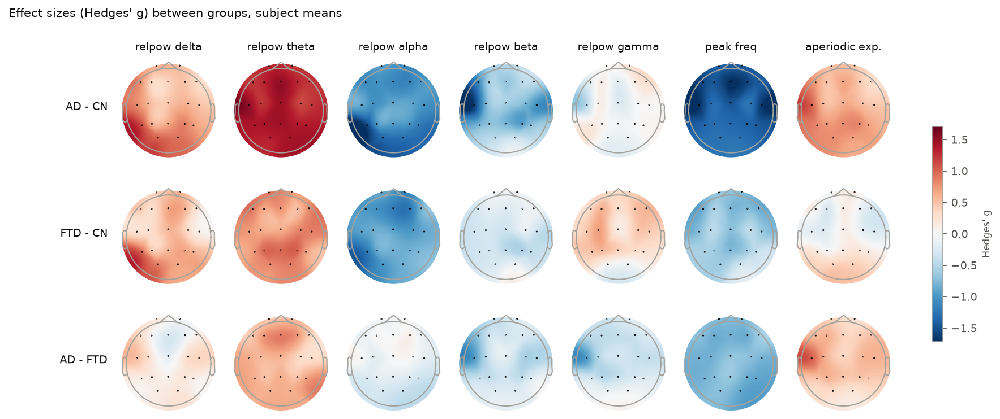
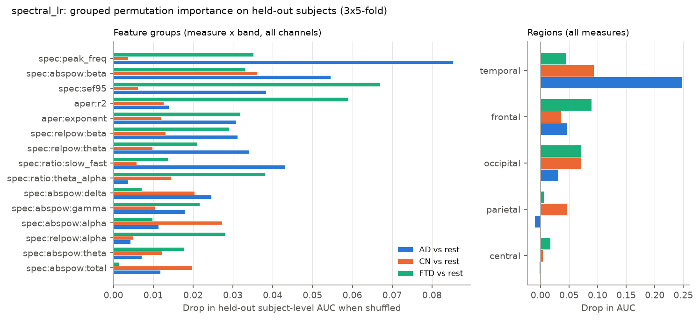

# Phase 1: leak-free, subject-level evaluation of non-deep baselines

**Task:** 3-class classification of Alzheimer's disease (AD, n = 36), frontotemporal dementia (FTD, n = 23) and cognitively normal controls (CN, n = 29) from resting-state, eyes-closed EEG (OpenNeuro ds004504, 19 channels, 500 Hz, preprocessed `derivatives/` recordings).

**Branch:** `overhaul`. The code lives in the `eegdementia/` package, with scripts in `scripts/` and tests in `tests/`. All numbers below come from the files in `results/` (called `results/overhaul/` until phase 3, when the original code moved to `legacy/`).

## TL;DR

- **Honest 3-class performance is about 60 % subject-level balanced accuracy** (chance is 33.3 %), with a 95 % CI of roughly ±7 pp. The best pre-specified model is a soft-voting ensemble at **61.1 ± 3.0 % [53.6, 68.0]**, with accuracy 64.0 % and macro one-vs-rest AUC 0.786. Letting the inner CV pick both the model family and its hyper-parameters (`nested_select`) gives **58.3 ± 3.6 % [51.7, 65.0]**. That is the fully unbiased estimate of "choose the best non-deep model"; the 2-3 pp gap is the optimism of picking a winner after the fact. Thirteen EEG-only models land between 58 and 61 %, and their differences are well inside the noise.
- **Everything is far above chance.** In label-permutation tests of the complete nested pipeline, the null mean is 33.5 % and its 95th percentile is 42.7-44.1 %. The observed values are 58.5 % (`rbp_lr`, p = 0.002, 500 permutations) and 60.5 % (`spectral_lr`, p = 0.0099, 100 permutations; this is the smallest p-value 100 permutations allow).
- **CN versus dementia works. AD versus FTD mostly does not.** CN recall is 80-90 % and CN one-vs-rest AUC about 0.87-0.90. FTD recall is only 26-45 %, and 46 % of FTD subjects are called AD. Binary repeated CV gives:
  - AD vs CN: 82.3 % balanced accuracy.
  - FTD vs CN: 75.2 %.
  - AD vs FTD: 60-63 %.
- **Our binary LOSO results match or beat the literature**, with no sign of leakage. AD vs CN reaches 84.6 % subject-level / 79.7 % epoch-level accuracy; the dataset authors report 77.0 % (RF on relative band power), DICE-net 83.3 %, and the 2026 benchmark's rigorous-study mean is 82.1 %. FTD vs CN reaches 78.8 % subject / 76.4 % epoch; the authors report 73.1 % and the rigorous-study mean is 75.2 %.
- **Comparison with the old model on its own 18-subject split.** At epoch level, the spectral models score 62-69 % accuracy (`spectral_lr` 67.4 %, `all_lgbm` 68.8 %, the ensemble 66.7 %, and 62.4 % for `all_lr`, which the nested selection picked), against the old graph transformer's 63.6 % chunk-level accuracy. `rbp_lr` and `riemann_ts_lr` score only 53-54 % on this split. So the old model is matched by a logistic regression on spectral features. With only 18 test subjects, however, the subject-level 95 % CIs span ±20 pp. That split is also *easier than average* for our models (+6 pp over their CV mean). A single split cannot rank models.
- **Age and sex explain little.** Age alone gives 36.9 % 3-class balanced accuracy (chance level), and age plus sex gives 42.6 % [33.5, 51.6]. Adding age and sex to the EEG models changes nothing: 60.5 becomes 59.7 % for `spectral_lr`, and 60.4 becomes 61.1 % for `all_lr`. Age is a mild confound only for FTD vs CN (FTD patients are younger; age alone reaches 58-60 %).
- **Important data finding.** In the native-reference (A1-A2) derivative data, **about 92 % of every channel's variance is a single common-mode signal**, mostly below 2 Hz and around 32 µV SD in *every* subject. We switched to the average reference, which removes it. Every model loses accuracy on the native reference: `rbp_lr` falls from 58.5 to 53.6 %, `spectral_lr` from 60.5 to 58.6 %, and `all_lr` from 60.4 to 58.4 %. The legacy pipeline z-scored native-reference channels, so most of its input was this artefact.
- **What drives the classifiers** is the classic EEG slowing: a higher theta/alpha ratio, lower peak (alpha) frequency, less alpha and beta, and more theta. The effects are large for AD vs CN (Hedges' g about 1.5-1.9), medium for FTD vs CN (g about 1.0-1.5) and small for AD vs FTD (g ≤ 0.6-0.9). Held-out permutation importance points to temporal channels for AD (dropping them costs 0.25 AUC) and frontal channels for FTD.

## 1. Data

- **Source:** the public OpenNeuro S3 bucket `s3://openneuro.org/ds004504` (no-sign-request, dataset version 1.0.9 according to `CHANGES`), downloaded to `$EEG_BIDS_ROOT` (outside the repo). Files fetched:
  - `participants.tsv`, `participants.json`, `dataset_description.json`, `README`, `CHANGES`.
  - `derivatives/sub-*/eeg/*.set`: **88 files, one per subject**, with data embedded (there are no `.fdt` files). They total **2,951,099,688 bytes (2.75 GiB)** and range from 13 to 55 MB each.
- **Subjects:** 36 AD, 29 CN, 23 FTD. Sex (F/M) is 24/12 for AD, 11/18 for CN and 9/14 for FTD. Mean age is 66.4 (AD), 67.9 (CN) and 63.6 (FTD) years. MMSE is **never used**, because it is essentially the label.
- **Recordings:** 19 channels in 10-20 positions, 500 Hz, 5-21 minutes each. The dataset authors band-passed them 0.5-45 Hz, re-referenced them to A1-A2, and cleaned them with ASR and ICA.
- **Discontinuities:** ASR removed data segments. These appear as EEGLAB `boundary` events (up to 56 per recording) and are real discontinuities.

## 2. Preprocessing (`eegdementia/data.py`, `eegdementia/config.py`)

| Step | Setting | Why |
|---|---|---|
| Crop | 30 **s** at the start and 30 **s** at the end | Settling and movement at recording onset and offset. This fixes the legacy bug, where `raw.crop(tmax=raw.times[-30])` removed 30 *samples*. |
| Reference | **average** (option: `native`) | See the common-mode finding below. |
| Resample | 250 Hz (MNE, anti-aliased) | Keeps everything up to 45 Hz and halves the storage. |
| Epochs | 10 s windows with a 5 s step (50 % overlap) | Chosen a priori. 4 s and 30 s windows are tested as a sensitivity analysis. |
| Boundary rejection | Drop windows within 0.5 s of an ASR `boundary` event | Avoids the discontinuities. |
| Amplitude rejection | Per subject, drop a window if log(peak-to-peak) > median + 5 × 1.4826 × MAD of that subject's windows | Uses only the subject's own unlabelled signal, so it cannot leak across subjects or labels. |

- **Yield:** 12,775 candidate windows. Of these, 792 (6.2 %) were dropped for boundaries and 367 (2.9 %) for amplitude, leaving **11,616 epochs**: 4,852 AD, 4,012 CN and 2,752 FTD. The per-subject count ranges from 40 to 225. *(Corrected in phase 2: an earlier version of this line said 187 / 11,796 / 4,929 / 4,075 / 2,792 / 227, which did not match the cached data. Every result used 11,616 epochs; see `n_epochs` in each `summary.json`.)*
- **Error handling:** errors are raised, never swallowed. The legacy script exited 0 on failure.

**Common-mode artefact.** In the native (A1-A2) derivative data, each channel's SD is about 31-38 µV in every subject and the mean inter-channel correlation is 0.92. The common-mode signal (the channel mean) has an SD of 32.4 ± 1.4 (AD), 32.9 ± 1.4 (CN) and 32.3 ± 2.8 (FTD) µV. About 78 % of its power lies at 0.5-2 Hz, and it carries **92 % of each channel's variance**. It shows no group difference (Kruskal-Wallis p = 0.14-0.68 on every statistic we checked). Once it is removed with the average reference, channel SDs fall to typical resting-EEG values (about 4-15 µV). Occipital relative alpha then reads 47 % in CN instead of 9 %, and the average-reference features classify better (section 6.7). Most likely this is a reference or drift artefact of the preprocessing. It is worth telling the dataset authors about, and **phase-2 deep models should use the average reference** (or at least never z-score native-reference channels).

**Caching.** Preprocessed continuous signals are cached at `$EEG_CACHE_DIR/prep_<hash>/sub-XXX.npz`. Per-epoch features, covariances and connectivity are cached at `$EEG_CACHE_DIR/prep_<hash>__ep_<hash>__feat_<hash>/sub-XXX.npz`. Every folder holds a `config.json`, and the hashes are derived from the dataclass configs, so changing a setting creates a new cache instead of silently reusing an old one. Building the cache takes about 20-30 s of preprocessing plus about 4-5 min of features for 10 s epochs (14 processes).

## 3. Features (`eegdementia/features.py`)

There are 1,348 features per epoch. Each is computed from a single epoch, so extraction needs no labels.

- **Spectral** (Welch, 2 s Hann windows, 0.5 Hz resolution, bands from the dataset paper: delta 0.5-4, theta 4-8, alpha 8-13, beta 13-25, gamma 25-45 Hz):
  - absolute log band power and total 0.5-45 Hz power;
  - relative band power;
  - log theta/alpha and log (delta+theta)/(alpha+beta);
  - peak frequency in 5-14 Hz and alpha centre of gravity in 7-13 Hz (IAF);
  - normalised spectral entropy, median frequency and 95 % spectral edge.
- **Aperiodic:** specparam 2.0 (FOOOF) in fixed mode over 1-40 Hz, giving exponent, offset and R² (median R² 0.97).
- **Time domain and complexity:**
  - Hjorth activity, mobility and complexity;
  - permutation entropy (order 5, delay 2);
  - sample entropy (on a 125 Hz copy);
  - Higuchi fractal dimension.
- **Connectivity**, per band:
  - magnitude-squared coherence, |imaginary coherency|, wPLI and amplitude-envelope correlation;
  - each is summarised as node strength per channel, 15 region-pair means (frontal, central, temporal, parietal and occipital, including within-region pairs) and a global mean;
  - the full 171-pair matrices are cached for phase 2.
- **Covariances:** OAS-shrunk 19 × 19 spatial covariance matrices for the 5 bands plus broadband.
- **Regional means:** every per-channel feature is also averaged over the 5 regions.

## 4. Evaluation protocol, as implemented (`eegdementia/evaluation.py`)

1. **Outer loop: repeated stratified group K-fold over all 88 subjects.**
   - 5 folds × 10 repeats. Each repeat uses `StratifiedKFold(shuffle=True, random_state=2026+1000·r)` on the one-row-per-subject table, which is exactly stratified *group* K-fold.
   - Every subject is tested exactly once per repeat, and all of its epochs follow it.
   - `check_split` asserts that train and test share no subject.
2. **Inner loop: selection sees the training subjects only.**
   - Every hyper-parameter choice uses an inner stratified 5-fold split over the outer-training subjects. Out-of-fold subject-level predictions are pooled.
   - The criterion is subject-level balanced accuracy, with ties broken by macro one-vs-rest AUC.
   - The winning setting is refitted on all outer-training subjects and applied once to the test subjects.
   - `nested_select` goes one level further: its inner CV also picks the *model family* (rbp_lr, spectral_lr, all_lr, riemann_ts_lr or all_lgbm) together with that family's grid.
3. **Everything fitted lives inside the training fold:** the median imputer, the scaler, the tangent-space reference means, the classifier and the weights.
   - Training epochs are weighted so that each subject carries equal weight and each class carries equal weight. This matters because subjects have 40-225 epochs and the classes are 36/29/23. *(Corrected in phase 3: this line said 40-227, the native-reference count.)*
   - For the RBF SVMs and the elastic net, at most 40 random epochs per *training* subject are used (the linear SVM uses all epochs). *(Corrected in phase 3: this line said "SVMs".)*
4. **Aggregation.** A subject's probability is softmax(mean of its epochs' log-probabilities), i.e. a normalised geometric mean.
5. **Metrics**, at subject level (primary) and epoch level (secondary):
   - balanced accuracy, accuracy, macro-F1, log-loss;
   - per-class recall, specificity, F1 and one-vs-rest AUC;
   - the confusion matrix.

   Per repeat, the five test folds are pooled. We report the mean ± SD across the 10 repeats, and a **95 % CI from a class-stratified bootstrap over subjects** (2,000 resamples). Each resample's metric is computed per repeat and then averaged over repeats. At epoch level this is a cluster bootstrap of 500 resamples, in which a drawn subject brings all of its epochs. Per-fold metrics are also saved.
6. **Chance.**
   - `DummyClassifier(prior)` run through the same harness;
   - subject-label permutation tests of the *whole* nested pipeline (`evaluation.permutation_test`). Each permutation reruns the full nested 5-fold CV once, so the p-value is conservative against the 10-repeat observed mean.
7. **Other protocols:**
   - binary LOSO for AD vs CN (65 subjects) and FTD vs CN (52), for comparability with the dataset authors, with nested inner 5-fold selection on the other subjects;
   - 3-class LOSO;
   - binary 5 × 10 repeated CV;
   - the legacy fixed split (70 train / 18 test; `LEGACY_TEST_SUBJECTS` reproduces pandas `sample(frac=0.8, random_state=42)`, which a unit test verifies).
8. **Tests** (`tests/`, 19 tests at the end of phase 1, all passing):
   - `test_leakage.py` checks with spy estimators that no fit call, inner or final, ever sees a test subject; that inner-validation predictions only touch training subjects; that the same holds for ensembles, nested model selection and the `fit_groups` hook; that every subject is predicted once per repeat; that stratification, weights and aggregation behave as intended; and that the legacy split is reproduced.
   - `test_features.py` checks feature shapes, that relative power sums to 1, peak-frequency detection, SPD covariances, connectivity ranges, regional means and boundary/amplitude rejection.

## 5. Models

Each model is evaluated with the harness. Grids are listed in `eegdementia/models.py`.

| Name | Input | Classifier |
|---|---|---|
| `rbp_lr` | relative band power per channel (95; the dataset authors' feature) | L2 logistic regression, C ∈ {1e-4 … 1} |
| `spectral_lr` / `spectral_region_lr` | all spectral + aperiodic features, per channel (399) / regional (105) | L2 LR |
| `complexity_lr`, `connectivity_lr` | Hjorth + entropies + HFD (114); connectivity summaries (700) | L2 LR |
| `all_lr`, `all_enet`, `all_linsvm`, `all_rbfsvm`, `all_rf`, `all_lgbm` | all 1,213 non-covariance features | L2 LR / elastic-net LR / linear SVM / RBF SVM / random forest / LightGBM |
| `spectral_rbfsvm` | spectral | RBF SVM |
| `riemann_ts_lr` | 6 band covariances → tangent space at the training Riemannian mean | L2 LR |
| `riemann_mdm` | 6 band covariances | minimum distance to Riemannian class means (distances summed over bands) |
| `ensemble_vote` | members fixed a priori: spectral_lr + riemann_ts_lr + all_lgbm, each tuned by its own inner CV | mean log-probability |
| `nested_select` | inner CV chooses among rbp/spectral/all LR, riemann_ts_lr and LightGBM, and their grids | selected model |
| `age_lr`, `age_sex_lr`, `*+age_sex` | confound checks (secondary only) | L2 LR |

SVM "probabilities" are the softmax of the one-vs-rest margins. They are valid for argmax, aggregation and AUC, but not calibrated.

## 6. Results

### 6.1 Main result: 3-class, 5-fold × 10 repeats, nested, all 88 subjects

Each cell is mean ± SD across repeats, with the bootstrap 95 % CI over subjects in brackets where shown. The full CSV is `tables/cv3.csv`.

| model | subject bal. acc. % (sd) [95% CI] | subject acc. % | subject macro-F1 % | subject macro AUC | recall AD/CN/FTD % | epoch bal. acc. % | epoch acc. % | runtime (min) |
|---|---:|---:|---:|---:|---:|---:|---:|---:|
| ensemble_vote | 61.1 ± 3.0 [53.6, 68.0] | 64.0 ± 2.8 [56.2, 70.8] | 59.6 ± 3.5 | 0.786 ± 0.018 [0.715, 0.848] | 69/86/28 | 59.5 ± 1.9 | 63.1 ± 1.6 | 112.3 |
| all_lr+age_sex | 61.1 ± 3.5 [54.0, 67.7] | 63.1 ± 3.5 [55.8, 69.8] | 59.9 ± 4.0 | 0.786 ± 0.021 [0.719, 0.844] | 63/86/34 | 58.9 ± 1.2 | 61.3 ± 1.1 | 21.9 |
| all_lgbm | 60.9 ± 2.3 [53.2, 67.9] | 64.2 ± 1.9 [56.4, 71.2] | 59.1 ± 3.1 | 0.776 ± 0.008 [0.704, 0.843] | 72/86/26 | 58.4 ± 1.4 | 62.4 ± 0.8 | 43.5 |
| all_linsvm | 60.6 ± 2.4 [53.7, 67.1] | 62.3 ± 2.5 [55.1, 69.0] | 59.0 ± 2.6 | 0.755 ± 0.028 [0.691, 0.816] | 58/90/33 | 57.3 ± 1.4 | 59.5 ± 1.1 | 43.4 |
| all_rf | 60.5 ± 1.9 [52.2, 68.6] | 63.2 ± 1.8 [54.7, 71.0] | 58.7 ± 2.3 | 0.759 ± 0.013 [0.680, 0.830] | 66/88/28 | 58.3 ± 1.5 | 61.5 ± 1.1 | 8.5 |
| spectral_lr | 60.5 ± 3.3 [52.8, 67.3] | 62.4 ± 3.3 [54.5, 69.4] | 59.6 ± 3.3 | 0.757 ± 0.021 [0.689, 0.820] | 64/81/37 | 57.3 ± 1.5 | 59.6 ± 1.6 | 6.6 |
| all_rbfsvm | 60.4 ± 1.3 [53.0, 67.7] | 63.2 ± 1.4 [55.6, 70.3] | 58.8 ± 1.1 | 0.757 ± 0.017 [0.687, 0.823] | 68/86/28 | 58.3 ± 1.3 | 61.6 ± 1.1 | 46.5 |
| all_lr | 60.4 ± 3.3 [53.3, 67.2] | 62.3 ± 3.2 [55.1, 69.1] | 59.2 ± 3.5 | 0.755 ± 0.026 [0.691, 0.815] | 62/84/34 | 57.4 ± 2.0 | 60.1 ± 1.5 | 15.7 |
| spectral_rbfsvm | 59.7 ± 1.8 [52.1, 67.2] | 62.5 ± 1.4 [54.8, 70.0] | 57.8 ± 2.6 | 0.722 ± 0.012 [0.653, 0.785] | 66/86/27 | 56.7 ± 1.2 | 59.8 ± 1.1 | 6.2 |
| spectral_lr+age_sex | 59.7 ± 2.7 [51.5, 67.3] | 61.5 ± 2.7 [53.4, 69.1] | 58.9 ± 2.8 | 0.767 ± 0.024 [0.697, 0.831] | 62/81/36 | 58.8 ± 1.9 | 60.8 ± 2.1 | 8.1 |
| all_enet | 58.8 ± 2.0 [51.2, 65.9] | 60.9 ± 1.8 [53.3, 68.1] | 57.7 ± 2.1 | 0.753 ± 0.024 [0.686, 0.813] | 62/82/32 | 56.6 ± 1.5 | 59.3 ± 1.2 | 42.3 |
| connectivity_lr | 58.8 ± 3.9 [51.3, 66.0] | 60.6 ± 3.4 [53.1, 68.0] | 58.2 ± 4.0 | 0.736 ± 0.035 [0.668, 0.803] | 62/78/36 | 53.4 ± 2.6 | 55.6 ± 2.2 | 11.7 |
| rbp_lr | 58.5 ± 2.4 [51.0, 65.8] | 60.8 ± 2.0 [53.2, 68.1] | 57.4 ± 2.8 | 0.756 ± 0.014 [0.694, 0.820] | 64/79/32 | 54.0 ± 1.6 | 56.5 ± 1.6 | 2.1 |
| nested_select | 58.3 ± 3.6 [51.7, 65.0] | 60.7 ± 3.8 [54.0, 67.3] | 57.2 ± 3.8 | 0.742 ± 0.030 [0.679, 0.799] | 64/80/31 | 55.2 ± 2.5 | 57.7 ± 2.7 | 119.4 |
| spectral_region_lr | 58.2 ± 2.2 [49.9, 66.5] | 59.5 ± 2.3 [51.0, 67.7] | 57.7 ± 2.6 | 0.727 ± 0.027 [0.655, 0.792] | 59/77/39 | 55.6 ± 1.6 | 57.5 ± 1.6 | 2.9 |
| riemann_ts_lr | 57.2 ± 4.5 [48.5, 65.2] | 58.3 ± 4.5 [49.8, 66.1] | 57.2 ± 4.4 | 0.733 ± 0.041 [0.655, 0.800] | 60/66/45 | 54.6 ± 3.5 | 56.1 ± 3.5 | 79.6 |
| complexity_lr | 56.1 ± 3.4 [48.5, 64.1] | 57.7 ± 3.1 [50.1, 65.6] | 55.9 ± 3.5 | 0.734 ± 0.027 [0.664, 0.804] | 62/67/39 | 52.9 ± 1.6 | 54.6 ± 1.8 | 3.0 |
| riemann_mdm | 52.8 ± 2.7 [43.8, 61.4] | 53.1 ± 3.0 [44.5, 61.4] | 51.6 ± 2.8 | 0.679 ± 0.020 [0.600, 0.755] | 45/74/39 | 49.6 ± 1.4 | 50.3 ± 1.6 | 5.1 |
| age_sex_lr | 42.6 ± 3.2 [33.5, 51.6] | 44.3 ± 3.5 [35.5, 53.1] | 42.4 ± 3.2 | 0.583 ± 0.020 [0.498, 0.661] | 58/33/36 | 42.4 ± 3.2 | 44.3 ± 3.6 | 1.1 |
| age_lr | 36.9 ± 1.3 [27.5, 45.2] | 33.0 ± 1.3 [24.8, 40.2] | 29.2 ± 1.6 | 0.516 ± 0.016 [0.436, 0.589] | 3/52/56 | 37.9 ± 1.3 | 33.3 ± 1.4 | 1.2 |
| chance_prior | 33.3 ± 0.0 [33.3, 33.3] | 40.9 ± 0.0 [40.9, 40.9] | 19.4 ± 0.0 | 0.481 ± 0.005 [0.450, 0.511] | 100/0/0 | 33.3 ± 0.0 | 41.8 ± 0.0 | 1.2 |



 



**Reading the table**

- Thirteen EEG-only models fall within 58-61 %, and their bootstrap CIs overlap almost completely. The repeat SD (2-4 pp) is as large as the gaps between them. We **cannot claim that any one of these models is better than another**.
- The model the inner CV would choose (`nested_select`, 58.3 %) sits slightly below the best individual models. That is the expected optimism of picking the best outer-CV number, which is itself a winner's-curse selection, so treat 58-61 % as the realistic range.
- Epoch-level balanced accuracy is 2-4 pp lower than subject level, because aggregating over about 130 epochs per subject averages out epoch noise.
- Per class, CN is found reliably (recall 0.79-0.90, OvR AUC 0.87-0.90), and AD moderately (recall 0.58-0.72, AUC 0.73-0.78). FTD is poor (recall 0.26-0.45, AUC 0.63-0.68). FTD errors go mostly to AD.
  *(Phase 3 check against the `summary.json` files: over the 13 EEG-only models at 58-61 %, the exact ranges are CN recall 0.77-0.90 and AUC 0.86-0.90, AD recall 0.58-0.72 and AUC 0.71-0.78, FTD recall 0.26-0.39 and AUC 0.57-0.68. The ranges above are approximate; FTD recall reaches 0.45 only for `riemann_ts_lr`, at 57.2 %.)*

### 6.2 Chance and permutation tests (`permutation/`)

| Pipeline | Observed subject bal. acc. (10-repeat mean) | Null mean ± SD | Null 95th percentile | p | Permutations |
|---|---:|---:|---:|---:|---:|
| `rbp_lr` | 58.5 % | 33.5 ± 6.1 % | 42.7 % | 0.002 | 500 |
| `spectral_lr` | 60.5 % | 33.5 ± 6.4 % | 44.1 % | 0.0099 | 100 |
| `chance_prior` (DummyClassifier) | 33.3 % (accuracy 40.9 %) | | | | |



Note that the chance-level spread of a single 5-fold CV on 88 subjects is ±6 pp (1 SD). This is why single-split results, including the old model's, are not reliable.

### 6.3 Legacy fixed split vs the old model (`legacy/`)

The same 18 test subjects as the April 2025 graph transformer are used: 7 AD, 6 CN and 5 FTD, with 70 training subjects. The old model's numbers are **chunk-level** (15 s chunks, native reference, per-channel z-scoring). Ours are **epoch-level** (10 s, average reference) plus subject-level.

| model | subject bal. acc. % (sd) [95% CI] | subject acc. % | subject macro-F1 % | subject macro AUC | recall AD/CN/FTD % | epoch bal. acc. % | epoch acc. % | runtime (min) |
|---|---:|---:|---:|---:|---:|---:|---:|---:|
| nested_select | 72.7 [50.2, 90.5] | 72.2 [50.0, 88.9] | 72.8 | 0.816 [0.636, 0.961] | 71/67/80 | 62.0 | 62.4 | 5.3 |
| all_lr | 72.7 [50.2, 90.5] | 72.2 [50.0, 88.9] | 72.8 | 0.816 [0.636, 0.961] | 71/67/80 | 62.0 | 62.4 | 0.8 |
| all_lgbm | 69.7 [48.2, 87.8] | 72.2 [50.0, 88.9] | 69.4 | 0.848 [0.659, 0.977] | 86/83/40 | 67.7 | 68.8 | 2.2 |
| spectral_lr | 66.8 [45.1, 85.7] | 66.7 [44.4, 83.3] | 66.2 | 0.903 [0.777, 0.986] | 57/83/60 | 67.0 | 67.4 | 0.5 |
| rbp_lr | 64.1 [42.4, 83.3] | 66.7 [44.4, 83.3] | 63.7 | 0.781 [0.588, 0.939] | 86/67/40 | 52.4 | 53.8 | 0.3 |
| all_linsvm | 62.1 [39.5, 81.0] | 61.1 [38.9, 77.8] | 60.5 | 0.849 [0.691, 0.965] | 43/83/60 | 63.0 | 63.0 | 1.5 |
| ensemble_vote | 59.4 [36.5, 81.9] | 61.1 [38.9, 83.3] | 59.3 | 0.809 [0.620, 0.964] | 71/67/40 | 65.7 | 66.7 | 6.8 |
| riemann_ts_lr | 53.8 [31.0, 75.6] | 55.6 [33.3, 77.8] | 53.8 | 0.750 [0.558, 0.915] | 71/50/40 | 52.2 | 53.0 | 3.0 |
| age_sex_lr | 50.2 [26.5, 72.7] | 50.0 [27.8, 72.2] | 50.0 | 0.592 [0.378, 0.795] | 57/33/60 | 49.7 | 49.5 | 0.1 |
| chance_prior | 33.3 [33.3, 33.3] | 38.9 [38.9, 38.9] | 18.7 | 0.500 [0.500, 0.500] | 100/0/0 | 33.3 | 36.4 | 0.3 |

| | accuracy | balanced accuracy | AUC AD / CN / FTD |
|---|---:|---:|---:|
| Old graph transformer dim=128 (chunk level, from README) | 63.6 % | 62.2 % | 0.79 / 0.84 / 0.65 |
| `spectral_lr`, epoch level | 67.4 % | 67.0 % | 0.81 / 0.89 / 0.86 |
| `all_lgbm`, epoch level | 68.8 % | 67.7 % | 0.85 / 0.91 / 0.77 |
| `ensemble_vote`, epoch level | 66.7 % | 65.7 % | 0.83 / 0.90 / 0.72 |
| `nested_select` (picked all_lr, C=0.1), epoch level | 62.4 % | 62.0 % | 0.79 / 0.91 / 0.70 |



On the old split, simple linear models on spectral features match or beat the 1.7 M-parameter transformer. The old model's single-split number is not a reliable estimate, though:

- With 18 subjects, the subject-level CI is about ±20 pp (for example, `all_lr` scores 72.7 % [50.2, 90.5]).
- This split is easier than average for our models: `spectral_lr` gets 66.8 % subject-level here against 60.5 % mean in repeated CV.
- The old training pipeline also selected checkpoints on chunk-level CV, where subjects leak across folds.

### 6.4 Binary LOSO vs the literature (`loso_ad_cn/`, `loso_ftd_cn/`)

Leave-one-subject-out. The inner 5-fold CV on the remaining subjects chooses C. Epoch-level accuracy pools all epochs of all left-out subjects, which is how Miltiadous et al. (2023) computed theirs.

**AD vs CN (36 vs 29)**

| model | subject acc. % [95% CI] | subject bal. acc. % | sens (AD) % | spec (CN) % | subject AUC [95% CI] | epoch acc. % | epoch bal. acc. % | runtime (min) |
|---|---:|---:|---:|---:|---:|---:|---:|---:|
| all_lr | 84.6 [75.4, 92.3] | 85.4 | 77.8 | 93.1 | 0.883 [0.793, 0.956] | 79.7 [72.0, 86.8] | 80.1 | 10.6 |
| riemann_ts_lr | 84.6 [75.4, 92.3] | 84.8 | 83.3 | 86.2 | 0.876 [0.780, 0.954] | 79.7 [70.2, 87.7] | 79.8 | 45.8 |
| rbp_lr | 80.0 [70.8, 89.2] | 80.3 | 77.8 | 82.8 | 0.871 [0.770, 0.949] | 77.2 [69.6, 85.3] | 77.6 | 1.6 |
| spectral_lr | 78.5 [67.7, 87.7] | 78.5 | 77.8 | 79.3 | 0.889 [0.801, 0.958] | 76.5 [67.6, 84.3] | 76.7 | 5.5 |
| chance_prior | 55.4 [55.4, 55.4] | 50.0 | 100.0 | 0.0 | 0.000 [0.000, 0.000] | 54.7 [52.5, 56.8] | 50.0 | 0.3 |
| age_lr | 50.8 [38.5, 63.1] | 50.5 | 52.8 | 48.3 | 0.519 [0.372, 0.664] | 50.0 [36.3, 62.6] | 49.8 | 0.2 |

**FTD vs CN (23 vs 29)**

| model | subject acc. % [95% CI] | subject bal. acc. % | sens (FTD) % | spec (CN) % | subject AUC [95% CI] | epoch acc. % | epoch bal. acc. % | runtime (min) |
|---|---:|---:|---:|---:|---:|---:|---:|---:|
| all_lr | 78.8 [67.3, 88.5] | 77.9 | 69.6 | 86.2 | 0.835 [0.708, 0.940] | 76.4 [67.8, 84.3] | 75.2 | 11.2 |
| spectral_lr | 75.0 [63.5, 86.5] | 74.4 | 69.6 | 79.3 | 0.780 [0.640, 0.904] | 72.5 [63.4, 82.4] | 71.4 | 4.4 |
| riemann_ts_lr | 73.1 [61.5, 84.6] | 72.7 | 69.6 | 75.9 | 0.769 [0.621, 0.891] | 70.3 [57.4, 81.2] | 69.4 | 45.6 |
| rbp_lr | 71.2 [59.6, 82.7] | 70.1 | 60.9 | 79.3 | 0.817 [0.688, 0.922] | 70.6 [63.8, 77.8] | 69.4 | 0.9 |
| age_lr | 59.6 [46.2, 73.1] | 59.3 | 56.5 | 62.1 | 0.585 [0.415, 0.744] | 61.1 [46.9, 73.8] | 60.7 | 0.3 |
| chance_prior | 55.8 [55.8, 55.8] | 50.0 | 0.0 | 100.0 | 0.000 [0.000, 0.000] | 59.3 [56.8, 61.9] | 50.0 | 0.2 |

 

**Literature, checked against the papers:**

| Source | Protocol | AD vs CN | FTD vs CN |
|---|---|---:|---:|
| Miltiadous et al. 2023, *Data* 8(6):95 (dataset paper), Tables 2-3 | LOSO; relative band power from 4 s epochs (50 % overlap); pooled epoch confusion | best: RF **77.01 %** (LightGBM 76.43, SVM 73.14, MLP 73.12, kNN 71.23) | best: MLP **73.12 %** (LightGBM 72.43, RF 72.01, SVM 70.14, kNN 67.34) |
| Miltiadous et al. 2023, *IEEE Access* (DICE-net), abstract | LOSO; RBP + coherence; 30 s windows with 15 s overlap | **83.28 %** (F1 84.12 %) | not reported in the abstract and not listed in the benchmark review |
| Miltiadous et al. 2026, *Cogn. Neurodyn.* (AHEPA benchmark), Table 15 | mean over its "validity-1" (subject-level validated, e.g. LOSO) studies | 82.11 % (all 40 studies: 90.81 %) | 75.18 % (all studies: 86.53 %) |
| same, 3-class AD/FTD/CN | validity-1 mean | 69.99 % accuracy, 59.53 % F1 (all studies: 87.04 %) | best validity-1: Chen et al. 2023, 76.01 % |

- **Verification of the brief's numbers.** The brief's "AD vs CN ≈ 83.3 %" is DICE-net's LOSO figure. We could not find the brief's "FTD vs CN ≈ 75.0 %" as a DICE-net result: DICE-net's abstract and the benchmark review report only AD vs CN for DICE-net. The closest verified figures are the benchmark's validity-1 mean of 75.18 % and the dataset paper's 73.12 %.
- **Our results sit exactly where rigorous studies land.** AD vs CN is 84.6 % subject / 79.7 % epoch (`all_lr`). FTD vs CN is 78.8 % subject / 76.4 % epoch. There is nothing suspicious here: our `rbp_lr` epoch-level LOSO result (77.2 % AD vs CN) reproduces the dataset authors' RBP benchmark (77.0 %) almost exactly.
- **LOSO chance artefact.** Under LOSO, the prior-only model has AUC 0 by construction: the left-out subject's class is always under-represented in its training set. This is why LOSO AUCs of trivial models are meaningless.

**Other binary and 3-class variants** (5 × 10 repeated nested CV, subject-level balanced accuracy):

| Task | `rbp_lr` | `spectral_lr` | age only |
|---|---:|---:|---:|
| AD vs CN | 79.0 ± 2.4 [70.4, 87.1] | **82.3 ± 4.1 [74.9, 89.0]** (AUC 0.884) | 50.0 |
| FTD vs CN | 73.9 ± 3.7 [63.9, 83.1] | **75.2 ± 3.5 [65.7, 84.3]** (AUC 0.792) | 58.3 (AUC 0.63) |
| AD vs FTD | **62.5 ± 3.3 [52.0, 72.6]** (AUC 0.645) | 60.0 ± 4.4 [50.0, 70.2] | 54.3 |

**3-class LOSO** (88 folds, nested inner 5-fold):

| model | subject bal. acc. % (sd) [95% CI] | subject acc. % | subject macro-F1 % | subject macro AUC | recall AD/CN/FTD % | epoch bal. acc. % | epoch acc. % | runtime (min) |
|---|---:|---:|---:|---:|---:|---:|---:|---:|
| spectral_lr | 63.2 [53.3, 73.3] | 64.8 [54.5, 73.9] | 62.8 | 0.782 [0.701, 0.861] | 67/79/43 | 58.3 | 61.0 | 30.8 |
| all_lr | 62.9 [52.9, 72.3] | 64.8 [54.5, 73.9] | 62.2 | 0.773 [0.693, 0.851] | 67/83/39 | 58.7 | 61.7 | 46.1 |
| rbp_lr | 58.2 [47.9, 68.2] | 60.2 [50.0, 69.3] | 57.5 | 0.760 [0.685, 0.830] | 64/76/35 | 54.1 | 56.4 | 5.1 |
| chance_prior | 33.3 [33.3, 33.3] | 40.9 [40.9, 40.9] | 19.4 | 0.000 [0.000, 0.000] | 100/0/0 | 33.3 | 41.8 | 0.7 |

The 3-class literature numbers (validity-1 mean of 70 % accuracy and 59.5 % F1, with LOSO and mostly epoch-level metrics) are consistent with ours: 61-64 % subject-level accuracy and 57-60 % macro-F1 under 5-fold CV. 3-class LOSO trains on 87 instead of 70 subjects per fold and is 2-3 pp higher: `spectral_lr` scores 63.2 % balanced and 64.8 % accuracy [CI 54.5, 73.9]. That fits the small-sample regime, where more training subjects still help. More (or pooled external) subjects may therefore matter more than model choice.

### 6.5 Age and sex confound check (secondary; not part of any headline)

| Model | 3-class subject bal. acc. | Macro AUC |
|---|---:|---:|
| age only | 36.9 ± 1.3 % [27.5, 45.2] | 0.516 |
| age + sex | 42.6 ± 3.2 % [33.5, 51.6] | 0.583 |
| `spectral_lr` (EEG only) → + age + sex | 60.5 → 59.7 % | 0.757 → 0.767 |
| `all_lr` (EEG only) → + age + sex | 60.4 → 61.1 % | 0.755 → 0.786 |

- **Age:** age alone carries essentially no 3-class information. The groups are roughly age-matched: AD 66.4, CN 67.9 and FTD 63.6 years.
- **Sex:** sex carries a little, since AD is two-thirds female and CN and FTD are mostly male. EEG models are not measurably helped by either.
- **FTD vs CN:** age alone reaches 59.6 % LOSO accuracy (AUC 0.59), because FTD patients are about 4 years younger. Part of the FTD-vs-CN EEG signal *could* therefore be age-related. The EEG models at 75-79 % are well above that, but a deconfounding analysis (for example, age-matched subsampling) belongs in phase 3.

### 6.6 Interpretability (`interpretability/`)

**Univariate group differences.** These use subject means. There are 648 spectral, aperiodic and complexity features, and 280 have FDR q < 0.05 in Kruskal-Wallis tests (`univariate_kruskal.csv`).

- **Strongest effect:** the theta/alpha ratio at every region. Hedges' g is 1.5-1.9 for AD vs CN, 1.1-1.5 for FTD vs CN, and 0.4-0.6 for AD vs FTD.
- **Next strongest:** peak frequency, which averages 7.3-7.7 Hz in AD, 8.7-9.1 Hz in FTD and 9.5-9.9 Hz in CN; g(AD-CN) is about -1.5 and g(AD-FTD) about -0.8.
- **Then:** relative theta (up) and relative alpha and beta (down).
- **Pattern:** FTD sits between CN and AD on nearly every spectral axis. That is exactly why AD vs FTD is hard for spectral features. The largest |g| for AD vs FTD over all features is only 1.03 (specparam R² at T3).



**What the model uses on held-out subjects.** This is grouped permutation importance for `spectral_lr` over 3 × 5 folds: a feature group is shuffled across test epochs, and we measure the drop in held-out subject-level one-vs-rest AUC.

- **Regions:** shuffling temporal channels costs AD-vs-rest 0.25 AUC and CN-vs-rest 0.09. Frontal channels matter most for FTD-vs-rest (0.09), with occipital next (0.07).
- **Measures:**
  - peak frequency (AD 0.085, FTD 0.035);
  - absolute beta power;
  - spectral edge frequency (FTD 0.067);
  - aperiodic fit quality and exponent (FTD);
  - the slow/fast ratio and relative theta (AD).

  Individual measure groups matter less than regions because the measures are redundant with each other. The fold-to-fold SDs are large (see the CSV), so treat the ranking as indicative.

This matches the clinical picture: temporoparietal slowing in AD, and frontal and anterior-temporal involvement in FTD.



Standardised LR coefficients are in `interpretability/coefficients_spectral_lr.png`. They are noisy because the features are highly collinear, so prefer the permutation importance above.

### 6.7 Sensitivity analyses (pre-specified models, same repeated nested CV)

Subject-level balanced accuracy, % (mean ± SD over 10 repeats [bootstrap 95 % CI]):

| condition | rbp_lr | spectral_lr | all_lr |
|---|---:|---:|---:|
| average ref., 10 s / 5 s (main) | 58.5 ± 2.4 [51.0, 65.8] | 60.5 ± 3.3 [52.8, 67.3] | 60.4 ± 3.3 [53.3, 67.2] |
| native A1-A2 ref., 10 s / 5 s | 53.6 ± 3.4 [45.3, 61.7] | 58.6 ± 2.7 [50.8, 66.7] | 58.4 ± 1.9 [51.3, 65.7] |
| average ref., 4 s / 2 s | 58.2 ± 2.9 [50.4, 66.0] | 62.9 ± 4.3 [55.3, 69.9] | – |
| average ref., 30 s / 15 s, boundary windows kept | 56.5 ± 3.9 [49.4, 63.4] | 58.3 ± 2.5 [50.4, 65.7] | – |
| subject-mean features (1 row per subject) | 57.4 ± 4.1 [49.9, 64.5] | 58.4 ± 2.2 [50.5, 66.0] | 57.5 ± 3.3 [49.6, 65.3] |

- **Average vs native reference:** the average reference is clearly better. See the common-mode artefact in section 2.
- **Window length:** results are within noise of each other. 4 s windows give the highest single number in this report (`spectral_lr` 62.9 % [55.3, 69.9], +2.4 pp over 10 s), but `rbp_lr` does not change (58.2 vs 58.5 %), and 30 s windows are slightly lower (56.5 / 58.3 %). The 30 s run keeps boundary windows, since otherwise some subjects have no clean 30 s window. We did **not** switch the main analysis to 4 s after seeing this, because that would be selection on the test folds. Phase 2 can adopt 4 s windows as a *pre-specified* choice if it wants to.
- **Reference:** the average reference beats the native reference for all three models, by 2-5 pp.
- **Subject-mean features:** training one row per subject is slightly *worse* (55.6-58.4 % for five models, against 57.2-60.5 % for the same models trained on epochs) than epoch-level training with log-probability aggregation. The epochs act as useful within-subject augmentation.

## 7. Runtime

These are wall-clock times on an i9-12900HX, CPU only, running 12 processes at below-normal priority, partly while other heavy workloads were running.

- **Features:** about 5 min for 10 s epochs, about 25 min for 4 s epochs.
- **3-class repeated nested CV (50 outer folds), per model:**
  - LR models: 2-16 min;
  - RF: 8 min;
  - linear, RBF SVM and elastic net: 42-47 min;
  - LightGBM: 44 min;
  - tangent space: 80 min (before memoising the Riemannian means);
  - ensemble: 112 min;
  - nested model selection: 119 min.
- **Binary LOSO:** 0.3-46 min per model.
- **Permutation tests:** 101 min for `rbp_lr` × 500 permutations and 106 min for `spectral_lr` × 100 (8 processes each).

Per-model runtimes are in the `runtime (min)` column of `tables/*.csv` and in `wall_time_s` inside each `summary.json`.

## 8. What deep models (phase 2) might and might not improve

What the numbers say:

1. Subjects are the unit of information. There are only 88 subjects (70 per training fold), and the subject-level CI is ±7 pp. **Any gain smaller than about 5 pp cannot be demonstrated** with this dataset, whatever the model. Phase 2 must use the same repeated nested CV (it is ready: see section 9) and report CIs. A single split is meaningless: the permutation null alone has SD ±6 pp.
2. CN vs dementia is already near what the literature considers a ceiling (AUC about 0.9). The open problem is **AD vs FTD**, where AUC is 0.60-0.65 with spectral features, and the two groups differ mainly in degree of slowing, with overlapping distributions. A deep model will only help if FTD carries information *not* captured by band power, peak frequency or connectivity summaries. Candidates are transient events, temporal dynamics and non-stationarity, and spatial patterns finer than 5 regions. We are sceptical but it is worth testing.
3. The ensemble and model family barely matter (58-61 %). That suggests the limit is the data, not model capacity. Expect a deep model trained from scratch on 70 subjects to land in the same band, or lower. The old transformer reached about 62 % on an easy split.

Phase-2 suggestions, in priority order:

1. **Pretrained EEG foundation models** (for example LaBraM, EEGPT, CBraMod, BIOT), fine-tuned or used as frozen feature extractors with a linear head. These have the best chance of adding information beyond spectra with so few subjects. Fall back on compact CNNs (ShallowConvNet, EEGNet, Deep4) as baselines.
2. **Inputs and training setup:**
   - average reference, 250 Hz (or resampled to what the pretrained model expects);
   - the same 10 s epochs (`build_dataset(include_raw=True)`);
   - per-epoch normalisation, never per subject;
   - subject-balanced sampling;
   - early stopping on an inner, **subject-grouped** validation split (the `fit_groups=True` hook);
   - aggregation of epoch log-probabilities per subject;
   - a fixed small hyper-parameter set to keep the nested cost tolerable.
3. **Hybrids:** feed deep embeddings plus the spectral features to the LR / LightGBM heads, or add a deep model as a 4th member of `ensemble_vote`. These are more likely to give a robust gain than an end-to-end model.
4. **Targeted objective for FTD vs AD:** class-weighted focal loss or a hierarchical dementia→subtype head. Report AD vs FTD separately (current reference 60-63 % balanced accuracy).
5. **Confound control:** repeat the best phase-2 model with age as a covariate or with age-matched FTD/CN resampling.

## 9. How to use the harness (for phase 2)

```python
from eegdementia import experiments as E, evaluation as ev
from eegdementia.models import ModelSpec

ds = E.build_dataset(include_raw=True)          # inputs: raw (11616,19,2500) uV, feat, cov, demo
splits = ev.outer_splits(ds.subjects, n_splits=5, n_repeats=10, seed=E.OUTER_SEED)  # identical to phase 1

class MyNet:                                    # any object with this interface works
    def __init__(self, lr, n_classes, seed): ...
    def fit(self, X, y, sample_weight=None, groups=None): ...   # groups = subject id per training epoch
    def predict_proba(self, X): ...             # (n, n_classes), columns in label order 0..n-1
    classes_ = ...                              # optional

spec = ModelSpec("my_net", "raw", lambda p, n, s: MyNet(**p, n_classes=n, seed=s),
                 grid=[{"lr": 1e-3}],            # >1 entry -> nested inner CV picks it (expensive for DL)
                 fit_groups=True,                # pass subject ids so early stopping can split by subject
                 sample_weight=True)             # balanced subject/class weights (w.mean()==1)
res = ev.run_cv(spec, ds, splits, inner_splits=5, n_jobs=1)   # n_jobs=1 for a single GPU
summary = ev.summarise(res)                     # subject + epoch metrics, mean±sd, bootstrap CIs
```

- **Saving results the phase-1 way:** `E.run_and_save(task, model_name, ds, specs_dict, n_jobs=1)` writes `results/<task>/<model>/` (`summary.json`, predictions and per-repeat and per-fold metrics). It also puts epoch-level predictions in `$EEG_CACHE_DIR/predictions/...`. Tasks are `cv3`, `legacy`, `loso3`, `loso_ad_cn`, `loso_ftd_cn`, `cv_ad_cn`, `cv_ftd_cn` and `cv_ad_ftd` (`E.task_data_and_splits`).
- **Labels and class names:** labels are 0 = AD, 1 = CN, 2 = FTD (`config.CLASS_NAMES`). Binary tasks recode them to [neg, pos] = [CN, AD] and so on.
- **CLI:** `scripts/run_phase1.py --task cv3 --models a,b [--repeats 10 --n-jobs 20 --reference average|native --epoch-length 10 --epoch-step 5 --keep-boundaries --subject-mean --tag NAME --skip-existing]`. The other scripts are `scripts/build_cache.py` (the same epoch and reference flags), `scripts/permutation_test.py --model M --n-perm N`, `scripts/interpret.py` and `scripts/make_figures.py`. The full reproduction is `scripts/run_all_phase1.sh`.
- **Low-level entry points:**
  - `data.load_participants()`;
  - `data.load_preprocessed(subject, PrepConfig())` returns a cached continuous `Recording`;
  - `data.epoch_recording(rec, EpochConfig())`;
  - `data.load_epochs(subjects)` returns (X, groups);
  - `features.FeatureStore(subjects, PipelineConfig())`.
- **Paths:** set with `EEG_BIDS_ROOT` and `EEG_CACHE_DIR`. Scripts call `eegdementia.utils.be_nice()`, which means CPU only, one BLAS thread per process and below-normal priority. **Phase 2 must remove `CUDA_VISIBLE_DEVICES=-1` for its own GPU runs** (`be_nice` only sets it if it is unset).
- **Leakage guarantees:** `run_cv` and `fit_predict` guarantee that nothing fitted by the harness sees test subjects. A deep model must not compute anything global itself, such as dataset-wide normalisation statistics from `X` passed to `predict_proba`. It may only use what it receives in `fit`.

## 10. Reproduction

```bash
uv sync                                # Python 3.12, locked deps
uv run pytest                          # 19 tests at the time (37 after phase 3)
bash scripts/run_all_phase1.sh         # caches, all experiments, permutation tests, figures (~15-20 h CPU)
```

Data download (about 2.8 GB):

```bash
uvx --from awscli aws s3 sync --no-sign-request s3://openneuro.org/ds004504/derivatives $EEG_BIDS_ROOT/derivatives
# plus participants.tsv, participants.json, dataset_description.json (aws s3 cp)
```

## References

- Miltiadous, A., Tzimourta, K. D., Afrantou, T., et al. (2023). A Dataset of Scalp EEG Recordings of Alzheimer's Disease, Frontotemporal Dementia and Healthy Subjects from Routine EEG. *Data*, 8(6), 95. https://doi.org/10.3390/data8060095. Tables 2-3 give the LOSO benchmarks quoted above.
- Miltiadous, A., Gionanidis, E., Tzimourta, K. D., Giannakeas, N., & Tzallas, A. T. (2023). DICE-net: A Novel Convolution-Transformer Architecture for Alzheimer Detection in EEG Signals. *IEEE Access*, 11, 71840-71858. https://doi.org/10.1109/ACCESS.2023.3294618
- Miltiadous, A., Ntetska, A., Aspiotis, V., et al. (2026). The AHEPA EEG benchmark: setting the standard for machine learning in dementia diagnosis, a scoping review. *Cognitive Neurodynamics*, 20(1), 95. https://doi.org/10.1007/s11571-026-10464-w (PMC13184051). Table 15 gives the validity-1 means.
- Dataset: OpenNeuro ds004504 v1.0.9, https://doi.org/10.18112/openneuro.ds004504.v1.0.9 (CC0).
